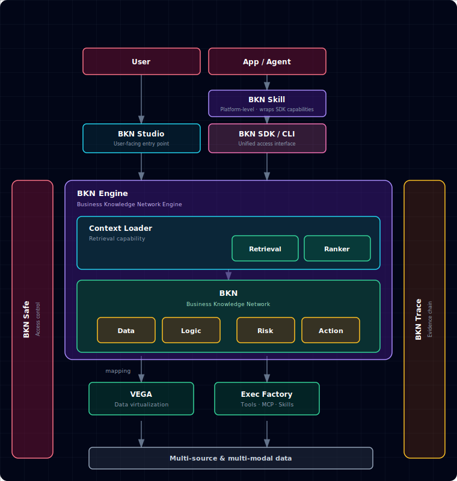

# BKN Foundry

[中文](README.zh.md) | English

[](LICENSE)

BKN Foundry is a harness-first foundation for enterprise decision agents. It turns fragmented data, knowledge, tools, and policies into governed context, safe execution, and verifiable feedback loops. With semantic modeling, real-time access, runtime control, and TraceAI, it helps AI systems reason, adapt, and act reliably in complex enterprises.

**On this page:** [📚 Quick links](#toc-quick-links) · [🚀 Quick start](#toc-quick-start) · [🛠️ OpenBKN SDK](#toc-bkn-sdk) · [🛡️ Administration](#toc-kweaver-admin) · [🏗️ BKN Foundry](#toc-kweaver-core) · [📐 BKN Lang](#toc-bkn-lang) · [📊 Benchmarks](#toc-benchmarks)

> **Note:** BKN Foundry is a **backend-only framework** — it does not include a web UI. All interactions are through the CLI, SDK, or API.

<a id="toc-quick-links"></a>

## 📚 Quick Links

- 🛠️ [OpenBKN SDK](https://github.com/openbkn-ai/bkn-sdk) - End-user / agent BKN CLI, TypeScript SDK, and the AI agent skill
- 🤝 [Contributing](rules/CONTRIBUTING.md) - Guidelines for contributing to the project
- 🚢 [Deployment](deploy/README.md) - One-click deploy to Kubernetes
- 📘 [Documentation](help/README.md) - Product documentation and usage guides ([EN](help/en/README.md) / [中文](help/zh/README.md))
- 📦 [Examples](examples/README.md) - End-to-end CLI walkthroughs (DB / CSV / actions)
- 🧾 [Release Notes](release-notes/) - All notable changes
- 🔗 [Upstream project](https://github.com/kweaver-ai/kweaver-core) - Forked from kweaver-ai/kweaver-core (Apache-2.0)

<a id="toc-quick-start"></a>

## 🚀 Quick Start

1. **Prerequisites & planning** — read the [Deployment Guide](deploy/README.md) and satisfy its prerequisites. **Linux** is the supported target for full installs; **macOS** local dev (kind) is optional — see [Mac install (dev)](deploy/dev/README.md) ([中文](deploy/dev/README.zh.md)).
2. **Pre-install host check / fix with `preflight.sh`** (recommended)

   On the **target install host**, run a system check before `deploy.sh`. It verifies kernel / sysctl / containerd / `kubectl` / `helm` / Node / BKN CLIs and can fix what's missing (each fix is opt-in unless `-y`):

```bash
git clone https://github.com/openbkn-ai/bkn-foundry.git
cd bkn-foundry/deploy
chmod +x preflight.sh deploy.sh onboard.sh

sudo bash ./preflight.sh                # check-only (default)
sudo bash ./preflight.sh --fix          # check + interactive fixes
sudo bash ./preflight.sh --fix -y       # auto-approve every fix
sudo bash ./preflight.sh --list-fixes   # preview which fixes would run, no changes
sudo bash ./preflight.sh --help         # all flags (--role, --skip, --report, --output=json, …)
```

   Exit codes: **0** OK, **1** any FAIL, **2** only WARN. Use `--report=/tmp/preflight.txt` to keep a full log.

3. **Run installation scripts**:

```bash
# (Same deploy/ directory as step 2)

# Minimum installation — recommended for first-time experience
./deploy.sh core install --minimum
# Equivalent to:
# ./deploy.sh core install --set auth.enabled=false --set businessDomain.enabled=false

# Full installation (includes auth & business-domain modules)
./deploy.sh core install

# Or specify addresses explicitly (skips interactive prompts):
#   --access_address       Address for clients to reach OpenBKN services (can be IP or domain)
#   --api_server_address   IP bound to a local network interface for K8s API server (must be a real NIC IP)
./deploy.sh core install \
  --access_address=<your-ip> \
  --api_server_address=<your-ip>

./deploy.sh --help
```

4. **Verify the deployment**:

```bash
# Check cluster status
kubectl get nodes
kubectl get pods -A

# Check service status
./deploy.sh core status
```

5. **Post-install bootstrap with `onboard.sh`** (recommended)

   On the **same host** as the install (where `kubectl` reaches the cluster), run the post-install bootstrap. It (re-runnable) registers an LLM + an embedding, patches the BKN ConfigMaps when the default embedding actually changes, and on a **full install** also creates the business user **`test`**, assigns every role from `openbkn admin role list`, switches `openbkn` to that user, and imports the Context Loader toolset:

```bash
cd deploy
sudo bash ./onboard.sh        # interactive; or:  sudo bash ./onboard.sh -y
sudo bash ./onboard.sh --help # all flags (--config=models.yaml, --enable-bkn-search, --skip-context-loader, …)
```

   > **Why `sudo`?** `onboard.sh` reads `$HOME/.openbkn-ai/config.yaml` (written by `sudo deploy.sh` into `/root/.openbkn-ai/`) and writes the `openbkn` auth token to `$HOME/.bkn`. Running it without `sudo` falls back to the in-repo template `deploy/conf/config.yaml` and may resolve a different access URL. **macOS dev path** (`bash deploy/dev/mac.sh onboard`) does **not** need `sudo`.

   Re-runs are safe: existing models / BKN defaults are detected and skipped. For the full sequence, the Mermaid flow, and the `openbkn` authentication notes (full ISF), see [help/en/install.md — Post-install: `onboard.sh`](help/en/install.md#post-install-onboardsh).

6. **Verify API access**

   BKN Foundry is backend-only and does not provide a web console. On the machine you use to reach the cluster (laptop, bastion, etc.), use the BKN CLI from [**bkn-sdk**](https://github.com/openbkn-ai/bkn-sdk): either `npm install -g @openbkn/bkn-sdk` or `npx openbkn` (no global install; see [OpenBKN SDK](#toc-bkn-sdk) below). Then run:

```bash
# Minimum install (no auth):
openbkn auth login https://<node-ip> -k
# Full install: sign in as the user onboard.sh created (default password 111111 unless you overrode it):
openbkn auth login https://<node-ip> -u test -p '<password>' -k

openbkn bkn list
# or with npx instead of a global install:
# npx openbkn auth login https://<node-ip> -k
# npx openbkn bkn list
```

7. **View help**:

```bash
openbkn --help                   # list all commands
openbkn <command> --help         # help for a specific command, e.g. openbkn bkn --help
```

For full product documentation, see the [Documentation](help/README.md) ([EN](help/en/README.md) / [中文](help/zh/README.md)).

> **Did a full install (without `--minimum`)?** Use the `openbkn admin` subcommands to manage users, organizations, roles, models, and audit logs — see [Administration](#toc-kweaver-admin) below.

<a id="toc-kweaver-core"></a>

## 🏗️ BKN Foundry

**BKN Foundry** is the AI-native platform foundation for autonomous decision-making. It sits between AI Agents (above) and AI/Data infrastructure (below), with the **Business Knowledge Network (BKN)** at its center, providing unified data access, execution, and security governance for Agents.

```text
            ┌─────────────────────────────────┐
            │     AI Agents (Claude Code, GPT,  │
            │     custom agents, ...)          │
            └───────────────┬─────────────────┘
                            │
            ┌───────────────▼─────────────────┐
            │     Business Knowledge Network   │
            │         BKN Foundry             │
            └───────────────┬─────────────────┘
                            │
            ┌───────────────▼─────────────────┐
            │   AI Infrastructure & Data       │
            │   Infrastructure                 │
            └─────────────────────────────────┘
```

BKN Foundry solves two critical pain points when connecting proprietary data with autonomous AI Agents:

### Context Engineering — High-Quality Context for Agents

In long-running agent scenarios, context inevitably faces explosion, decay, pollution, and high token costs. BKN Foundry addresses these through the Business Knowledge Network:

- **Context explosion containment** — Multi-source candidates are first organized and aggregated via the BKN semantic network, then unified by Context Loader (recall → coarse ranking → fine ranking) to retain only key evidence and constraints, avoiding massive prompt fragments that cause decision drift. Overall accuracy reaches **93%+**.
- **Context decay mitigation** — Replaces long-text stacking with "real-time facts + evidence citations", keeping reasoning grounded around specific objects and reducing forgetting and hallucination risks in long inputs. Accuracy improves **15%+** over baselines across scenario types.
- **Context pollution isolation** — Builds precise enterprise digital twins through the BKN network, blocking unreliable content and potential injection risks outside the knowledge and execution boundary, ensuring a clean and controllable reasoning chain.
- **Token cost compression** — Converts multi-source materials into structured object information fetched on demand (not full-text concatenation), improving information density within the same budget. Token consumption reduced **30%+** while improving accuracy.

### Harness Engineering — Safe & Controllable Execution

Beyond "seeing more", Agents must "do it right". BKN Foundry provides constraint engineering capabilities for enterprise-grade safe execution:

- **Explainable decisions** — Uses "Object → Action → Rule → Constraint" knowledge structures to express business intent graphs, grounding tool invocation and parameter selection to explicit semantic boundaries and rule dependencies, making it clear "why this action was taken".
- **Traceable evidence chain** — From action intent → knowledge node → data source → mapping/operator → final invocation, full-chain tracing is supported. Entities and relationships can be traced back to source data and active rules, enabling audit and review.
- **Controllable execution loop** — Unifies identity and access control down to knowledge network object/action permissions, with pre-execution validation, mid-execution policy interception, and post-execution audit logging, achieving "authorizable, approvable, revocable" security loops.
- **Risk prevention mechanism** — Models risks as "Risk Types" linked to Action Types; performs risk assessment and simulation before execution, with automatic downgrade/blocking/secondary confirmation when thresholds are hit, blocking high-risk actions before they execute.

### Core Architecture



| Component | Description |
| --- | --- |
| **Access layer** | **BKN SDK / CLI** (unified access interface) and **BKN Skill** (platform-level skill layer wrapping SDK capabilities) — for users, apps, and agents. **BKN Studio** (the user-facing web console) lives in a separate frontend repo ([openbkn-ai/bkn-studio](https://github.com/openbkn-ai/bkn-studio)) and is **not** part of this backend release. |
| **BKN Engine** | The Business Knowledge Network engine: **Context Loader** (Retrieval recall + Ranker ordering) over the **BKN**, which describes the business through four elements — Data / Logic / Risk / Action — and maps concepts down to the execution layer |
| **VEGA** | Data virtualization — hides differences between underlying multi-source & multi-modal data |
| **Exec Factory** | Execution factory — orchestrates tools, MCP, and Skills |
| **BKN Safe** | Access control — unified identity, permissions, and policy entry point; security controls and auditing per business object / action |
| **BKN Trace** | Evidence chain — traces BKN call chains (intent → knowledge node → data source → mapping / operator); traceable and explainable |

See the full write-up in [BKN Reference Architecture](docs/bkn-architecture.md).

<a id="toc-bkn-lang"></a>

### 📐 BKN Lang

BKN Lang is a Markdown-based business knowledge modeling language, designed for human-machine bidirectional friendliness:

- **Easy to develop** — Based on standard Markdown syntax, eliminating code barriers entirely. Business experts write, read, and modify definitions via WYSIWYG editors, with rapid version diff and collaborative review — modifying system rules is like editing a document.
- **Easy to understand** — "Object-Relationship-Risk-Action" four-in-one model perfectly maps enterprise business models. Humans read business semantics; Agents parse precise context constraints in real-time. Logic is made explicit, rejecting black boxes, fundamentally reducing LLM reasoning hallucination and logical deviation.
- **Easy to integrate** — Definitions stored as full-text in specific database fields with no complex underlying table coupling. Context Loader dynamically loads on demand, discarding static hardcoding. Plug-and-play across systems and Agents, flowing as lightweight assets through AI Data Platform.

### Key Value Summary

| Metric | Value |
| --- | --- |
| **Scenario Coverage** | Q&A, workflow execution, intelligence analysis, decision judgment, exploration |
| **TCO Reduction** | 70% lower with integrated platform |
| **BKN Build Efficiency** | 300% improvement in knowledge network construction |
| **Token Cost Savings** | 50% reduction through context optimization and compression |

<a id="toc-bkn-sdk"></a>

## 🛠️ OpenBKN SDK

<a id="toc-kweaver-core-and-sdk"></a>

### Install the SDK on the client

After deploying BKN Foundry, we recommend installing [bkn-sdk](https://github.com/openbkn-ai/bkn-sdk) as your next step. The SDK provides the BKN CLI (the `openbkn` command) and AI Agent Skills — the primary way to interact with the platform.

[**bkn-sdk**](https://github.com/openbkn-ai/bkn-sdk) gives AI agents (Claude Code, GPT, custom agents, etc.) access to OpenBKN knowledge networks via the BKN CLI. It also provides Python and TypeScript SDKs for programmatic integration.

Install the CLI with:

```bash
npm install -g @openbkn/bkn-sdk
```

Or run it without a global install:

```bash
npx openbkn --help
```

### AI Agent Skills

Install the `openbkn` skill from [**bkn-sdk**](https://github.com/openbkn-ai/bkn-sdk) with [`npx skills`](https://www.npmjs.com/package/skills):

```bash
npx skills add https://github.com/openbkn-ai/bkn-sdk --skill openbkn
```

- **`openbkn`** — full OpenBKN APIs and CLI conventions (knowledge networks, agents, models, skills, toolbox, trace) so assistants can operate the platform on your behalf. See [skills/openbkn/SKILL.md](https://github.com/openbkn-ai/bkn-sdk/blob/main/skills/openbkn/SKILL.md).

**Before using the skill**, authenticate with your OpenBKN instance:

```bash
openbkn auth login https://your-openbkn-instance.com
```

> **Self-signed certificate?** If your instance uses a self-signed or untrusted TLS certificate (common for fresh deployments without a CA-issued cert), add `-k` to skip certificate verification:
>
> ```bash
> openbkn auth login https://your-openbkn-instance.com -k
> ```

### Headless / no-browser authentication (SSH, CI, containers)

The BKN CLI supports authenticating without a local browser or without pasting callback URLs.

**Which option to use**

| Your situation | Use | Notes |
| --- | --- | --- |
| **Username and password** sign-in is available | **Method 1** (HTTP, `-u` / `-p`) | One command on the host; no need to copy an OAuth callback from elsewhere. |
| **[bkn-sdk](https://github.com/openbkn-ai/bkn-sdk) is installed** (the `kweaver` command works) | **Method 2** (`auth export` / replay) | After browser login, run `openbkn auth export` and **replay** the one-line command on the headless target. |
| bkn-sdk is **not** installed; you usually run **`npx openbkn`** | **Method 3** (`--no-browser`) | After signing in on another device, an **extra step**: **copy the full callback URL** or **only the authorization code** (*copy code*), then paste at `Paste URL or code` in the headless terminal. |

**Method 1 — Username/password HTTP sign-in (fully non-interactive on the host, no browser required)**

No Node/Chromium needed — the CLI calls the platform's `/oauth2/signin` endpoint over HTTPS and stores the returned tokens. Suitable for CI runners, minimal Linux containers, and any host without a browser:

```bash
openbkn auth login https://your-instance -u <username> -p <password> -k
```

`-u` / `-p` together select this path automatically (you can also add `--http-signin` explicitly). If you omit `-u` / `-p`, the CLI prompts for them on stdin (password input is hidden on a TTY). The CLI saves tokens under `~/.bkn/` including a `refresh_token` when the IdP returns one — same auto-refresh behavior as a normal browser login.

**Method 2 — Export & replay (bkn-sdk installed; export and replay)**

On a machine that **has** the BKN CLI, sign in with the browser once, then `export` a one-line command for the headless host — you do not need to transcribe the OAuth callback URL or code in the terminal by hand.

1. On a machine **with** a browser, run `openbkn auth login https://your-instance`. After success, export credentials:

```bash
openbkn auth export              # prints a one-line command you can paste on the headless host
```

2. On the **headless** host, paste the exported command. It uses `--client-id`, `--client-secret`, and `--refresh-token` to exchange tokens and save credentials under `~/.bkn/`:

```bash
openbkn auth login https://your-instance \
  --client-id <ID> --client-secret <SECRET> --refresh-token <TOKEN>
```

**Method 3 — `--no-browser` (when bkn-sdk is not installed; extra copy/paste of URL or code)**

Use this when the CLI is not installed globally and you run via `npx openbkn` (or similar). Compared with **Method 2**, you must **manually copy** the URL or code from the browser after login.

```bash
openbkn auth login https://your-instance --no-browser
# or: npx openbkn auth login https://your-instance --no-browser
```

The CLI prints an OAuth URL instead of opening a local browser window. Open that URL on **any device** with a browser (phone, laptop, etc.). After login, the browser redirects to a `localhost` callback — an error page is normal. Copy the **full URL** from the address bar, **or only the authorization code**, and paste it at the prompt below (the extra **Paste URL or code** step):

```
Open this URL on any device (use a private/incognito window if you need the full sign-in form):

  https://your-instance/oauth2/auth?redirect_uri=...&client_id=...

After login, the browser may show an error page (this is expected if nothing listens on localhost).
Copy the FULL URL from the address bar and paste it here, or paste only the authorization code.

Paste URL or code>
```

> With saved `~/.bkn/` sessions, the CLI automatically exchanges `refresh_token` for a new access token when it expires — no extra flags needed. You can also set environment variables (`BKN_BASE_URL`, `BKN_TOKEN`) instead of persisting credentials to disk.

Full details: [bkn-sdk — Authentication](https://github.com/openbkn-ai/bkn-sdk#authentication). You can also reuse the `~/.bkn/` directory from a machine where the CLI finished login, or set the environment variables above.

### CLI

```bash
openbkn auth login https://your-openbkn.com -k    # authenticate (-k for self-signed TLS)
openbkn bkn list                                 # list knowledge networks
openbkn bkn search <kn-id> "query"               # semantic search
openbkn --help                                   # all subcommands
```

### TypeScript SDK

Minimal example (after CLI login or equivalent credentials):

```typescript
import { createClient } from "@openbkn/bkn-sdk";

const bkn = createClient({ baseUrl: "https://your-openbkn.com", token: process.env.BKN_TOKEN });

const networks = await bkn.kn.list({ limit: 10 });
const results  = await bkn.kn.search("<kn-id>", "What risks exist in the supply chain?");
```

For streaming and the full resource API (`bkn.kn`, `bkn.context`, `bkn.models`, `bkn.vega`, `bkn.admin`, …), see the [bkn-sdk](https://github.com/openbkn-ai/bkn-sdk) repository docs and examples.

<a id="toc-kweaver-admin"></a>

## 🛡️ Administration

Platform administration (users, organizations, roles, models, audit) is **built into the same `openbkn` CLI** under the `openbkn admin` subcommands — there is no separate admin tool. Most `admin` commands target services that come with a **full install** (`auth.enabled=true`, `businessDomain.enabled=true`); on a `--minimum` install they return 401 / 404 (expected).

```bash
openbkn admin org tree                          # list departments
openbkn admin user create --login alice         # default password 123456 (forced change at first login)
openbkn admin user reset-password -u alice      # admin reset
openbkn admin role list
openbkn admin role add-member <roleId> -u alice
openbkn admin llm add                           # register an LLM
openbkn admin small-model add                   # register an embedding model
openbkn admin audit list --user alice --start 2026-04-01 --end 2026-04-30
openbkn admin call /api/user-management/v1/management/users -X GET   # raw HTTP with auth header
```

> New users start with the platform default password **`123456`** and must change it on first sign-in (ISF user-store behavior). Respect the **separation-of-duties** built-in accounts (`system`, `admin`, `security`, `audit`) — operators should use individual accounts, not the shared `admin`.

The `openbkn` skill (installed above) also covers these admin tasks. Full command tree and security notes: see the [bkn-sdk](https://github.com/openbkn-ai/bkn-sdk) repository docs.

<a id="toc-benchmarks"></a>

## 📊 Benchmarks & Experiments

### Unstructured Data Q&A — Cross-Platform Comparison

Based on 145 HR scenario samples (resume corpus with 118 multi-format PDFs), covering simple information lookup, cross-section experience analysis, and multi-hop comprehensive reasoning. All platforms used DeepSeek V3.2 + BGE M3-Embedding with identical data sources, tested in Agentic mode.

| Metric | BKN Foundry (v0.3.0) | BiSheng | Dify (v0.15.3) | RAGFlow (v0.17.0) |
| --- | --- | --- | --- | --- |
| **Accuracy** | **99.31%** (144/145) | 86.90% (126/145) | 96.55% (140/145) | 86.90% (126/145) |
| **Avg Latency** | 43.69s | **19.52s** | 63.82s | 71.56s |
| **P90 Latency** | 56.92s | 32.53s | 79.15s | 95.37s |
| **Avg Token** | 21.36K | **4.98K** | 36.25K | 16.28K |

BKN Foundry is the only platform that breaks the traditional RAG "performance impossible triangle" — achieving >99% accuracy while keeping inference cost and latency at production-ready levels. Dify trades high token consumption (1.7x) for decent accuracy; BiSheng sacrifices reasoning depth for speed; RAGFlow falls behind on both accuracy and latency.

### Ablation Studies — Key Technical Levers

The following ablation experiments identify the contribution of each BKN Foundry component:

**Retrieval Depth** — Increasing retrieval limit from 10 to 20 raised accuracy from 96.67% to 100%, with only +6.48s latency. Context Loader's semantic reranking and compression enable BKN Foundry to effectively handle the increased context without "Lost in the Middle" effects.

**Schema Preloading** — With Context Loader preloading the BKN schema:

| Configuration | Accuracy | Avg Steps | Avg Token |
| --- | --- | --- | --- |
| Schema preloaded | **100.0%** | **3.2** | **20.07K** |
| No schema | 93.33% | 5.8 | 38.54K |

Schema provides Agents with a clear "map" of entity relationships, reducing reasoning steps by 44.8% and token consumption by 47.9%.

**Tool Curation** — Precise tool selection outperforms providing all available tools:

| Configuration | Accuracy | Avg Steps | Avg Token |
| --- | --- | --- | --- |
| Full toolset (6 tools) | 75.0% | 7.1 | 42.3K |
| Curated toolset (3 tools) | **100.0%** | **2.4** | **12.8K** |

With excessive tools, Agents favor "seemingly powerful" broad-search tools whose noise triggers reflection loops and path divergence. Curated tools constrain Agents onto the correct path, achieving one-shot resolution.

**Path Guidance** — Encoding domain expert experience into executable reasoning templates:

| Configuration | Path Guidance | Tools | Accuracy | Avg Latency | Avg Token |
| --- | --- | --- | --- | --- | --- |
| Explore-kn_search | Yes | 3 | **100.0%** | **37.82s** | **15,420** |
| No guidance, 2 tools | No | 2 | 100.0% | 53.06s | 23,287 |
| No guidance, 3 tools | No | 3 | 80.0% | 53.28s | 19,870 |

Path guidance tells Agents "how to walk" for efficiency; tool curation "reduces wrong turns" for stability. Combined, they deliver optimal production performance.

### Heterogeneous Data Reasoning — F1 Bench

F1 Bench is based on the BIRD test set with the Formula-1 database mixed with 30 unstructured documents, testing Agent capabilities in structured + unstructured heterogeneous data reasoning.

| Metric | BKN Foundry | Dify Retrieval Baseline |
| --- | --- | --- |
| **Overall Accuracy** | **92.96%** | 78.87% |
| **SQL Waste Rate** | **8.2%** | 24.5% |
| **SQL Hit Efficiency** | **0.226** | 0.137 |
| **Total SQL Calls** | **292** | 408 |

## License

BKN Foundry is multi-licensed:

- Components originating from the upstream
  [kweaver-ai/kweaver-core](https://github.com/kweaver-ai/kweaver-core)
  remain under the Apache License 2.0 (see LICENSE-APACHE.txt).
- OpenBKN access-layer components (BKN SDK / CLI, BKN Skill) are under
  the Apache License 2.0 (see LICENSE-APACHE.txt).
- The OpenBKN module BKN Safe is under the OpenBKN License — a modified
  version of the Apache License 2.0 with additional conditions (see
  LICENSE-OPENBKN.txt). (BKN Studio is a separate frontend repo,
  [openbkn-ai/bkn-studio](https://github.com/openbkn-ai/bkn-studio), and is
  licensed there — not part of this backend release.)

The license for each file is stated in its header. See NOTICE for a
per-component breakdown.
