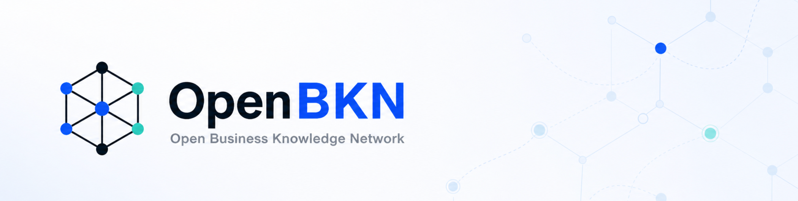
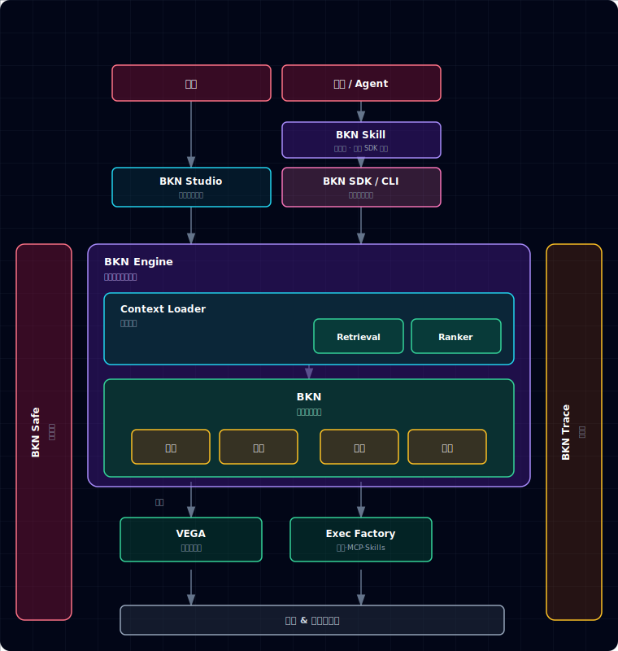

<p align="center">
  <picture>
    <source media="(prefers-color-scheme: dark)" srcset="help/banner-dark.png">
    <source media="(prefers-color-scheme: light)" srcset="help/banner-light.png">
    
  </picture>
</p>

# BKN Foundry

中文 | [English](README.md)

[](LICENSE)

OpenBKN 是一个本体驱动的业务知识网络平台，它通过本体建模，将分散在文档、系统、流程、规则与专家经验中的数据、逻辑，转化为智能体可理解、可执行、可验证的业务知识网络，从而让智能体在真实业务环境中准确、安全、可靠地落地，不止生成答案，而是持续创造可执行、可追踪、可验证的业务价值。

**BKN Foundry** 是 OpenBKN 的技术底座，为上述业务知识网络提供统一的数据接入、安全执行与治理能力。

**本文目录：** [📚 快速链接](#toc-quick-links) · [🚀 快速开始](#toc-quick-start) · [🛠️ OpenBKN SDK](#toc-bkn-sdk) · [🛡️ 平台管理](#toc-kweaver-admin) · [🏗️ BKN Foundry](#toc-kweaver-core) · [📐 BKN Lang](#toc-bkn-lang) · [📊 基准测试](#toc-benchmarks)

> **注意：** BKN Foundry 是**纯后台框架**，不提供 Web 界面。所有交互通过 CLI、SDK 或 API 完成。

<a id="toc-quick-links"></a>

## 📚 快速链接

- 🛠️ [OpenBKN SDK](https://github.com/openbkn-ai/bkn-sdk) - 终端用户 / Agent 使用的 BKN CLI、TypeScript SDK 与 Agent Skill
- 🤝 [贡献指南](rules/CONTRIBUTING.zh.md) - 项目贡献指南
- 🚢 [部署指南](deploy/README.zh.md) - 一键部署到 Kubernetes
- 📘 [产品文档](help/README.md) - 产品文档与使用指南（[中文](help/zh/README.md) / [EN](help/en/README.md)）
- 📦 [示例](examples/README.zh.md) - 端到端 CLI 示例（数据库 / CSV / Action）
- 🧾 [版本发布](release-notes/) - 重要变更记录
- 🔗 [上游项目](https://github.com/kweaver-ai/kweaver-core) - Fork 自 kweaver-ai/kweaver-core（Apache-2.0）

<a id="toc-quick-start"></a>

## 🚀 快速开始

1. **前置与规划** — 阅读 [部署文档](deploy/README.zh.md) 并满足其中前置条件。**正式安装以 Linux 为主**；**macOS** 可选本机 kind 验证见 [Mac 安装（开发向）](deploy/dev/README.zh.md)。
2. **装机前自检 / 修复：`preflight.sh`**（推荐）

   在**安装目标主机**上，安装前先做一次系统体检：内核 / sysctl / containerd / `kubectl` / `helm` / Node / BKN CLI 等，缺什么可按需修（每项默认 y/N 询问，`-y` 全自动）：

```bash
git clone https://github.com/openbkn-ai/bkn-foundry.git
cd bkn-foundry/deploy
chmod +x preflight.sh deploy.sh onboard.sh

sudo bash ./preflight.sh                # 仅检查（默认）
sudo bash ./preflight.sh --fix          # 检查 + 交互修复
sudo bash ./preflight.sh --fix -y       # 全部自动确认修复
sudo bash ./preflight.sh --list-fixes   # 预览将会执行哪些修复，不改任何东西
sudo bash ./preflight.sh --help         # 全部参数（--role、--skip、--report、--output=json 等）
```

   退出码：**0** 全 OK；**1** 有 FAIL；**2** 仅有 WARN。`--report=/tmp/preflight.txt` 可保存完整日志。

3. **执行安装部署脚本**：

```bash
# （仍在第 2 步的 deploy/ 目录下）

# 最小化安装 — 首次体验推荐
./deploy.sh core install --minimum

# 完整安装（包含 auth 和 business-domain 模块）
./deploy.sh core install

# 或显式指定地址（跳过交互提示）：
#   --access_address       客户端访问 OpenBKN 服务的地址（可以是 IP 或域名）
#   --api_server_address   K8s API Server 绑定的本机网卡 IP（必须是真实的网卡地址）
./deploy.sh core install \
  --access_address=<你的IP> \
  --api_server_address=<你的IP>

# 查看帮助
./deploy.sh --help
```

4. **验证部署**：

```bash
# 检查集群状态
kubectl get nodes
kubectl get pods -A

# 检查服务状态
./deploy.sh core status
```

5. **安装后引导：`onboard.sh`**（推荐）

   在**同一台机器**（kubectl 能访问集群）上执行安装后引导脚本：注册一个 LLM + 一个 embedding；只有当**默认 embedding 实际变更**时才会 patch BKN ConfigMap 并滚动重启 `bkn-backend` / `ontology-query`；在**完整安装**下还会创建业务用户 **`test`**、把 `openbkn admin role list` 中的所有角色都挂上、切换 `openbkn` 到该用户身份，并导入 Context Loader 工具集：

```bash
cd deploy
sudo bash ./onboard.sh        # 交互模式；或：sudo bash ./onboard.sh -y
sudo bash ./onboard.sh --help # 所有参数（--config=models.yaml、--enable-bkn-search、--skip-context-loader 等）
```

   > **为什么要 `sudo`？** `onboard.sh` 会读 `$HOME/.openbkn-ai/config.yaml`（由 `sudo deploy.sh` 写到 `/root/.openbkn-ai/` 下）并把 `openbkn` 认证 token 写到 `$HOME/.bkn`。不加 `sudo` 会回退到仓库内模板 `deploy/conf/config.yaml`，可能解析出和安装时不一致的 access URL。**macOS 开发路径**（`bash deploy/dev/mac.sh onboard`）**不需要** `sudo`。

   可重复运行：脚本会先探测平台已有的模型与 ConfigMap 状态，已注册 / 已配置的会自动跳过。完整流程图、ISF 全量下 `openbkn` 的鉴权说明见 [help/zh/install.md — Post-install：`onboard.sh`](help/zh/install.md#post-installonboardsh安装后引导)。

6. **验证 API 访问**

   BKN Foundry 为纯后台，无 Web 控制台。在**访问端**（本机、跳板机等）通过 [**bkn-sdk**](https://github.com/openbkn-ai/bkn-sdk) 使用 BKN CLI：可全局安装 `npm install -g @openbkn/bkn-sdk`，或直接用 `npx openbkn`（无需全局安装；详见下文 [OpenBKN SDK](#toc-bkn-sdk)）。再执行：

```bash
# 最小化安装（未启用鉴权）：
openbkn auth login https://<节点IP> -k
# 完整安装：以 onboard.sh 创建的业务用户登录（未自定义时默认密码 111111）：
openbkn auth login https://<节点IP> -u test -p '<密码>' -k

openbkn bkn list
# 或使用 npx 免全局安装：
# npx openbkn auth login https://<节点IP> -k
# npx openbkn bkn list
```

7. **查看帮助**：

```bash
openbkn --help                   # 列出所有命令
openbkn <command> --help         # 查看某命令的帮助，例如 openbkn bkn --help
```

完整产品文档参见[文档中心](help/README.md)（[中文](help/zh/README.md) / [EN](help/en/README.md)）。

> **完整安装（未加 `--minimum`）？** 用 `openbkn admin` 子命令进行用户、组织、角色、模型与审计管理 — 详见下文 [平台管理](#toc-kweaver-admin)。

<a id="toc-kweaver-core"></a>

## 🏗️ BKN Foundry

**BKN Foundry** 是自主决策型 AI 原生平台底座。它位于 AI Agent（上层）与 AI/数据基础设施（下层）之间，以**业务知识网络（BKN）**为核心，为 Agent 提供统一的数据访问、执行与安全治理能力。

```text
            ┌─────────────────────────────────┐
            │     AI Agents（Claude Code、GPT、  │
            │     自定义 Agent 等）             │
            └───────────────┬─────────────────┘
                            │
            ┌───────────────▼─────────────────┐
            │         业务知识网络              │
            │         BKN Foundry             │
            └───────────────┬─────────────────┘
                            │
            ┌───────────────▼─────────────────┐
            │   AI 基础设施 & 数据基础设施       │
            └─────────────────────────────────┘
```

BKN Foundry 解决专有数据与自主智能体结合时的两大核心技术痛点：

### 上下文工程 — 为 Agent 提供高质量上下文

在持续运行的 Agent 场景下，上下文不可避免地面临爆炸、腐烂、污染和高 Token 消耗问题。BKN Foundry 通过业务知识网络解决这些挑战：

- **上下文爆炸可收敛** — 多源候选先经 BKN 语义网络组织与聚合，再由 Context Loader 统一精排（召回→粗排→精排）仅保留关键证据与约束，避免海量片段直塞提示词导致决策失焦，整体准确率达到 **93%+**。
- **长上下文腐烂可缓解** — 以"实时事实 + 证据引用"替代长文堆叠，让推理围绕稳定对象展开，降低超长输入下的遗忘与幻觉风险，各类型场景下准确率相比同类型平台提升 **15%+**。
- **上下文污染可隔离** — 通过 BKN 网络准确构建企业数字孪生，把低可信内容、矛盾信息与潜在注入风险挡在知识与执行边界之外，保证推理链路干净可控。
- **Token 成本可压缩** — 将多源材料转为结构化对象信息按需获取而非全文拼接，在相同预算下提升信息密度，实现准确率提升的同时 Token 平均下降 **30%+**。

### 约束工程 — 安全可控的执行能力

Agent 不仅要"看得更全"，更要"做得更稳"。BKN Foundry 提供约束工程能力，实现企业级安全执行：

- **可解释决策** — 以"对象→动作→规则→约束"的知识结构表达业务意图，把工具调用与参数选择落到明确语义边界与规则依据上，解释清楚"为什么这么做"。
- **可追溯证据链** — 从行动意图→知识节点→数据来源→映射/算子→最终调用全链路留痕，支持按实体/关系回溯到源数据与生效规则，做到可审计、可复盘。
- **可管控执行闭环** — 统一身份与访问控制绑定到知识网络的对象/动作权限，执行前置校验、执行中策略拦截、执行后审计回写，实现"可授权、可批准、可收敛"的安全闭环。
- **可风险预防机制** — 将风险建模为"风险类"并与行动类关联，执行前做风险评估与仿真，命中阈值自动降级/阻断/二次确认，把高风险动作挡在执行之前。

### 核心架构



| 组件 | 说明 |
| --- | --- |
| **接入层** | **BKN SDK / CLI**（统一接入接口）与 **BKN Skill**（平台级技能层，封装 SDK 能力）——面向用户、应用与 Agent。**BKN Studio**（用户交互 Web 控制台）位于独立前端仓库 [openbkn-ai/bkn-studio](https://github.com/openbkn-ai/bkn-studio)，**不属于**本后端 release。 |
| **BKN Engine** | 业务知识网络引擎：**Context Loader**（Retrieval 召回 + Ranker 排序）作用于 **BKN**——以数据 / 逻辑 / 风险 / 行动四要素描述业务，并经映射下达到执行层 |
| **VEGA** | 数据虚拟化——屏蔽底层多源 & 多模态数据差异 |
| **Exec Factory** | 执行工厂——调度工具、MCP 与 Skills |
| **BKN Safe** | 权限管控——统一身份、权限与策略入口，按业务对象 / 动作做安全管控与审计 |
| **BKN Trace** | 证据链——追踪 BKN 调用链路（意图 → 知识节点 → 数据源 → 映射 / 算子），可追溯、可解释 |

完整说明见 [BKN 参考架构](docs/bkn-architecture.zh.md)。

<a id="toc-bkn-lang"></a>

### 📐 BKN Lang

BKN Lang 是基于 Markdown 扩展语法的业务知识建模语言，人机双向友好：

- **易开发** — 基于通用 Markdown 语法，彻底消除代码壁垒。业务专家可通过所见即所得编辑器直接编写、阅读和修改业务逻辑定义，支持快速版本比对与协作审计，像修改文档一样修改系统规则。
- **易理解** — "对象类-关系类-风险类-行动类"四位一体模型完美映射企业业务模型。人类读懂业务含义，智能体实时"阅读"并解析出精准的上下文约束。逻辑显性化，拒绝性黑盒，从根本上降低大模型的推理幻觉与逻辑偏差。
- **易集成** — 定义仅作为全量文本存储于数据库特定字段，无复杂底层表结构强耦合。通过 Context Loader 按需动态加载，摒弃静态硬编码。跨系统、跨智能体高度兼容，作为轻量级资产在 AI Data Platform 中流畅流转。

### 核心价值总结

| 指标 | 数据 |
| --- | --- |
| **场景覆盖** | 问答、流程执行、情报分析、决策判断、探索类场景 |
| **TCO 降低** | 一体化平台降低建设成本 70% |
| **BKN 构建效率** | 业务知识网络构建效率提升 300% |
| **Token 成本** | 上下文优化与压缩，消耗降低 50% |

<a id="toc-bkn-sdk"></a>

## 🛠️ OpenBKN SDK

<a id="toc-kweaver-core-and-sdk"></a>

### 在客户端上安装 SDK

安装完 BKN Foundry 后，建议首先安装 [bkn-sdk](https://github.com/openbkn-ai/bkn-sdk)。SDK 提供 BKN CLI（即 `openbkn` 命令）和 AI Agent Skills，是与平台交互的主要方式。

[**bkn-sdk**](https://github.com/openbkn-ai/bkn-sdk) 通过 BKN CLI 为 AI 智能体（Claude Code、GPT、自定义 Agent 等）提供对 OpenBKN 知识网络的访问能力，同时提供 TypeScript SDK 用于编程集成。

使用以下命令安装 CLI：

```bash
npm install -g @openbkn/bkn-sdk
```

或者无需全局安装，直接运行：

```bash
npx openbkn --help
```

### AI Agent Skills

从 [**bkn-sdk**](https://github.com/openbkn-ai/bkn-sdk) 使用 [`npx skills`](https://www.npmjs.com/package/skills) 安装 `openbkn` 技能：

```bash
npx skills add https://github.com/openbkn-ai/bkn-sdk --skill openbkn
```

- **`openbkn`** — 让 AI 编程助手掌握 OpenBKN 的 API 与 CLI（知识网络、Agent、模型、Skill、Toolbox、Trace），可代替用户操作平台。详见 [skills/openbkn/SKILL.md](https://github.com/openbkn-ai/bkn-sdk/blob/main/skills/openbkn/SKILL.md)。

**使用该 skill 前**，需先完成 OpenBKN 实例认证：

```bash
openbkn auth login https://your-openbkn-instance.com
```

> **注意** 如果你的实例使用了自签名或不受信任的 TLS 证书（新部署且未配置 CA 签发证书时很常见），添加 `-k` 参数跳过证书验证：
>
> ```bash
> openbkn auth login https://your-openbkn-instance.com -k
> ```

### 无浏览器环境认证（SSH、CI、容器等）

BKN CLI 支持在没有本地图形浏览器、或不便粘贴回调 URL 的场景下完成认证。

**如何选用：**

| 你的情况 | 请用 | 说明 |
| --- | --- | --- |
| **方便使用用户名与密码** | **方式 1**（HTTP，`-u` / `-p`） | 本机一条命令完成，无需在终端外复制 OAuth 回调。 |
| **已安装** [bkn-sdk](https://github.com/openbkn-ai/bkn-sdk)（本机可执行 `openbkn`） | **方式 2**（`auth export` / 重放） | 在能打开浏览器的机器上完成登录后执行 `openbkn auth export`，将导出的一行命令在目标环境**重放**。 |
| **尚未安装** bkn-sdk、通常用 `npx openbkn` 等运行 | **方式 3**（`--no-browser`） | 在其它设备上打开 OAuth 链接登录后**多一步**：从地址栏**复制完整回调 URL 或只复制 authorization code**（界面常提示 *copy code*），粘贴到无头端 `Paste URL or code` 处。 |

**方式 1 — 用户名密码 HTTP 登录（本机全自动化，无需浏览器）**

无需 Node/Chromium，CLI 通过 HTTPS 直接调用平台的 `/oauth2/signin` 接口并保存返回的令牌，适用于 CI Runner、最小化 Linux 容器以及任何无浏览器主机：

```bash
openbkn auth login https://你的实例 -u <用户名> -p <密码> -k
```

同时提供 `-u` 与 `-p` 时会自动走该路径（也可显式追加 `--http-signin`）。如果不带 `-u` / `-p`，CLI 会从 stdin 交互获取（TTY 下密码不回显）。令牌写入 `~/.bkn/`；若 IdP 返回 `refresh_token`，后续换发 access token 的行为与普通浏览器登录一致。

**方式 2 — 导出凭据后重放（已安装 bkn-sdk 时；export / 重放）**

在**已安装** BKN CLI 的机器上，用浏览器完成一次正常登录后，用 `export` 得到可粘贴到无头环境的一行命令，无需在终端里手抄 OAuth 回调 URL 或 code。

1. 在**有浏览器**的机器上执行 `openbkn auth login https://你的实例`，登录成功后导出凭据：

```bash
openbkn auth export              # 输出一行命令，可直接在无头机器上粘贴执行
```

2. 在**无头机器**上粘贴导出的命令，它通过 `--client-id`、`--client-secret`、`--refresh-token` 换取令牌并写入 `~/.bkn/`：

```bash
openbkn auth login https://你的实例 \
  --client-id <ID> --client-secret <SECRET> --refresh-token <TOKEN>
```

**方式 3 — `--no-browser`（未安装 bkn-sdk 时；多一步复制 URL 或 code）**

适用于尚未安装 CLI、常配合 `npx openbkn ...` 使用的场景。与**方式 2**相比，在另一设备上登录后需**多一步**手动从浏览器**复制** URL 或 code。

```bash
openbkn auth login https://你的实例 --no-browser
# 或: npx openbkn auth login https://你的实例 --no-browser
```

CLI 不会打开本机图形浏览器，而是打印一个 OAuth URL。将该 URL 复制到**任意有浏览器的设备**（手机、笔记本等）打开并登录。登录后浏览器会跳转到 `localhost` 回调地址 — 页面可能显示错误（这是正常的）。从浏览器地址栏复制**完整 URL**，**或仅复制 authorization code**，粘贴回 CLI 提示符（即下方 *Paste URL or code* 多出的这一步）：

```
Open this URL on any device (use a private/incognito window if you need the full sign-in form):

  https://你的实例/oauth2/auth?redirect_uri=...&client_id=...

After login, the browser may show an error page (this is expected if nothing listens on localhost).
Copy the FULL URL from the address bar and paste it here, or paste only the authorization code.

Paste URL or code>
```

> 已有 `~/.bkn/` 保存的会话时，CLI 会在 access token 过期后自动使用 `refresh_token` 换取新令牌，无需额外操作。也可通过环境变量（`BKN_BASE_URL`、`BKN_TOKEN`）传入凭据，无需持久化到磁盘。

完整说明见 [bkn-sdk — 认证说明](https://github.com/openbkn-ai/bkn-sdk#authentication)。也可将 CLI 已完成登录的机器上的 `~/.bkn/` 目录拷贝过来使用，或配置上述环境变量。

### CLI

```bash
openbkn auth login https://your-openbkn.com -k    # 登录（自签名证书加 -k）
openbkn bkn list                                 # 列出知识网络
openbkn bkn search <kn-id> "关键词"              # 语义搜索
openbkn --help                                   # 查看全部子命令
```

### TypeScript SDK

精简示例（需先完成 CLI 登录或等价凭据配置）：

```typescript
import { createClient } from "@openbkn/bkn-sdk";

const bkn = createClient({ baseUrl: "https://your-openbkn.com", token: process.env.BKN_TOKEN });

const networks = await bkn.kn.list({ limit: 10 });
const results  = await bkn.kn.search("<kn-id>", "供应链有哪些风险？");
```

流式对话与完整资源 API（`bkn.kn`、`bkn.context`、`bkn.models`、`bkn.vega`、`bkn.admin` 等）更多用法，请参阅 [bkn-sdk](https://github.com/openbkn-ai/bkn-sdk) 仓库文档与示例。

<a id="toc-kweaver-admin"></a>

## 🛡️ 平台管理

平台管理（用户、组织、角色、模型、审计）**已内置在同一个 `openbkn` CLI** 的 `openbkn admin` 子命令下——无需独立的管理工具。`admin` 命令主要操作**完整安装**（`auth.enabled=true`、`businessDomain.enabled=true`）带的服务；`--minimum` 安装下大多返回 401 / 404（正常裁剪）。

```bash
openbkn admin org tree                          # 列出部门
openbkn admin user create --login alice         # 初始密码随机生成，仅创建响应返回一次（initial_password），首次登录强制改密
openbkn admin user reset-password -u alice      # 管理员重置密码
openbkn admin role list
openbkn admin role add-member <roleId> -u alice
openbkn admin llm add                           # 注册 LLM
openbkn admin small-model add                   # 注册 Embedding 模型
openbkn admin audit list --user alice --start 2026-04-01 --end 2026-04-30
openbkn admin call /api/user-management/v1/management/users -X GET   # 自动带认证头的原始 HTTP
```

> `user create` 未显式传密码时会为账号随机生成初始密码，仅在创建响应中返回一次（`initial_password`），首次登录强制改密。内置「三权分立」账号 `system / admin / security / audit` 请使用各自的个人账号操作，避免共用 `admin`。

上文安装的 `openbkn` skill 也覆盖这些管理操作。完整命令树与安全说明见 [bkn-sdk](https://github.com/openbkn-ai/bkn-sdk) 仓库文档。

<a id="toc-benchmarks"></a>

## 📊 基准测试与实验

### 非结构化数据问答 — 跨平台横向对比

基于 145 个 HR 场景样本（简历库含 118 份多格式 PDF），覆盖简单信息查询、跨段落经验分析、多跳综合推理三类场景。各平台统一使用 DeepSeek V3.2 + BGE M3-Embedding，相同数据源，均采用 Agentic 模式测试。

| 指标 | BKN Foundry (v0.3.0) | BiSheng | Dify (v0.15.3) | RAGFlow (v0.17.0) |
| --- | --- | --- | --- | --- |
| **通过率** | **99.31%** (144/145) | 86.90% (126/145) | 96.55% (140/145) | 86.90% (126/145) |
| **平均响应时间** | 43.69s | **19.52s** | 63.82s | 71.56s |
| **P90 响应时间** | 56.92s | 32.53s | 79.15s | 95.37s |
| **平均 Token 消耗** | 21.36K | **4.98K** | 36.25K | 16.28K |

唯有 BKN Foundry 突破了传统 RAG 架构的"性能不可能三角"——在满足企业级严苛可靠性（>99% 准确率）的同时，将推理成本和时间延迟控制在高度生产可用的水平。Dify 属于"高消耗换取高通过率（力大砖飞）"；BiSheng 则是"牺牲准确推理换取表面上的快速低耗"；RAGFlow 在准确率和延迟上均落后。

### 消融实验 — 关键技术杠杆

以下消融实验定位了 BKN Foundry 各组件的贡献度：

**检索深度** — 将检索 limit 从 10 提升至 20，通过率从 96.67% 提升至 100%，响应时间仅增加 +6.48s。得益于 Context Loader 的语义重排与上下文压缩能力，BKN Foundry 有效消化了扩大的上下文窗口，突破了传统 RAG 的"中间迷失"瓶颈。

**Schema 预加载** — 通过 Context Loader 提前预加载业务本体 Schema：

| 配置 | 通过率 | 平均推理步数 | 平均 Token 消耗 |
| --- | --- | --- | --- |
| 预加载 Schema | **100.0%** | **3.2 步** | **20.07K** |
| 不预加载 Schema | 93.33% | 5.8 步 | 38.54K |

Schema 为智能体提供了清晰的实体关系"地图"，推理步数平均减少 44.8%，Token 消耗降低 47.9%。

**工具治理** — 精准裁剪工具集优于提供全部可用工具：

| 配置 | 通过率 | 平均推理步数 | 平均 Token 消耗 |
| --- | --- | --- | --- |
| 完整工具集（6 个） | 75.0% | 7.1 步 | 42.3K |
| 精简工具集（3 个） | **100.0%** | **2.4 步** | **12.8K** |

提供全库搜索工具时，智能体倾向于选择"看起来功能更强大"的工具，但其返回结果噪声远高于限定范围的查询工具，触发多轮反思循环导致路径发散。精简后智能体被"约束"在正确路径上，实现一次通过。

**路径指引** — 将领域专家经验编码为可执行的推理路径模板：

| 配置 | 路径指引 | 工具数 | 通过率 | 平均响应时间 | 平均 Token |
| --- | --- | --- | --- | --- | --- |
| Explore-kn_search | 有 | 3 | **100.0%** | **37.82s** | **15,420** |
| 无路径，2 工具 | 无 | 2 | 100.0% | 53.06s | 23,287 |
| 无路径，3 工具 | 无 | 3 | 80.0% | 53.28s | 19,870 |

路径指引通过"告诉智能体怎么走"来提升效率，工具精简通过"减少可选的岔路"来保证稳定性。在生产环境中，两者的组合可以实现最优的性能表现。

### 异构数据推理 — F1 Bench

F1 Bench 由 BIRD 测试集中 Formula-1 数据库混合 30 篇非结构化文档设计，测试智能体结合结构化+非结构化异构数据推理能力。

| 指标 | BKN Foundry | Dify 召回基线 |
| --- | --- | --- |
| **整体准确率** | **92.96%** | 78.87% |
| **SQL 浪费率** | **8.2%** | 24.5% |
| **SQL 命中效率** | **0.226** | 0.137 |
| **总 SQL 调用次数** | **292** | 408 |

## 🤝 加入社群

扫码加入社群，获取支持、反馈问题、了解最新动态：

<p align="center">
  
</p>

## 许可 / License

BKN Foundry 采用多许可（multi-licensed）。各组件和文件的权威归属以仓库
[许可证总览](LICENSE)及 [NOTICE](NOTICE) 为准：

- 源自上游
  [kweaver-ai/kweaver-core](https://github.com/kweaver-ai/kweaver-core)
  的组件保持 [Apache License 2.0](LICENSE-APACHE.txt)。
- 明确引用 OpenBKN License 的 OpenBKN 净新增文件采用
  [OpenBKN License](LICENSE-OPENBKN.txt)，即附加额外条件的 Apache License
  2.0 修改版本。
- BKN Studio 和 BKN SDK 在独立仓库维护，适用各自仓库随附的许可证文件。

每个文件适用的许可证在其文件头注明。
