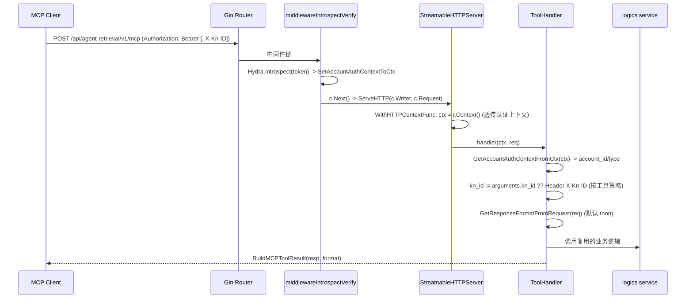

# feature-mcp-server: Streamable HTTP MCP Server - 实现设计文档

## 文档信息

| 项目 | 内容 |
|------|------|
| **需求编号** | feature-mcp-server |
| **关联需求文档** | [需求设计文档.md](./需求设计文档.md) |
| **文档版本** | v2.0 |
| **创建日期** | 2026-02-01 |
| **最近更新** | 2026-06-23 |

> **本文定位**：只描述 MCP Server 的**实现意图与关键设计决策**（为什么这样做），不维护工具清单与字段级 schema。
> 工具的权威事实源：
> - 元数据（名称/描述）：`server/driveradapters/mcp/schemas/tools_meta.json`（随二进制内嵌）
> - 输入/输出 schema：`server/driveradapters/mcp/schemas/<tool>.json`
> - 运行时自描述：`GET /api/agent-retrieval/v1/mcp/info`
> - 人读参考：[../../release/tool-usage-guide.md](../../release/tool-usage-guide.md)
>
> 工具增删改只动上述 JSON + handler，本文不随之变动。

---

## 1. 概述

本文档描述 Agent Retrieval Streamable HTTP MCP Server 的技术实现方案：在现有 Gin 应用中挂载一个 MCP Server，把 context-loader 的知识网络检索能力以 MCP 工具形式对外暴露，供 Cursor、Claude Desktop 及其它 Agent 接入。

### 1.1 设计目标

1. **最小侵入**：在现有 Gin 应用中挂载 MCP Server，复用中间件与 `logics` 业务层，不复制业务逻辑
2. **认证与上下文**：ToolHandler 能拿到 token 内省得到的账户上下文（account_id/account_type）与 kn_id
3. **数据驱动、零硬编码清单**：工具的名称/描述/schema 全部来自内嵌 JSON，新增工具不改注册框架，也不改文档
4. **同一能力多入口**：同一份业务逻辑同时服务 MCP、内部 REST 与执行工厂 toolbox，避免三套实现漂移

### 1.2 设计原则

- **单一职责**：MCP 相关代码集中在 `mcp` 子包
- **复用**：检索/查询逻辑复用现有 `logics` 层 service
- **单一事实源**：工具元数据与 schema 集中在 `schemas/*.json`，注册逻辑、`/mcp/info` 自描述、外部文档都读它

---

## 2. 架构设计

### 2.1 分层架构

```
┌─────────────────────────────────────────────────────────────────┐
│                     Driver Adapters (HTTP)                        │
│  ┌─────────────────────────┐   ┌───────────────────────────────┐ │
│  │ rest_public_handler      │   │ mcp/ (MCP Server)             │ │
│  │  /api/agent-retrieval/v1 │   │  - 内嵌 schemas/*.json         │ │
│  │  - REST 工具入口(/kn/*)   │   │  - 数据驱动 AddTool            │ │
│  │  - 挂载 MCP: /mcp/*path   │──▶│  - StreamableHTTPServer        │ │
│  │  - /mcp/info 自描述       │   │  - GET /mcp/info               │ │
│  │  中间件: IntrospectVerify │   └───────────────────────────────┘ │
│  └─────────────────────────┘                                       │
│  ┌─────────────────────────┐                                       │
│  │ rest_private_handler     │   内部入口(toolbox/服务间)            │
│  │  /api/agent-retrieval/in/v1                                      │
│  └─────────────────────────┘                                       │
├───────────────────────────────────────────────────────────────────┤
│                     Business Logic (logics/*)  —— 复用              │
│   knsearch / knquerysubgraph / knlogicpropertyresolver /            │
│   knactionrecall / knfindskills / knrunsql + drivenadapters(BKN)    │
└───────────────────────────────────────────────────────────────────┘
```

**挂载位置**：MCP Server 挂在**公开路由组** `/api/agent-retrieval/v1` 下（完整端点 `/api/agent-retrieval/v1/mcp`），使用 `middlewareIntrospectVerify`（Bearer token 认证），以支持外部 MCP 客户端。

### 2.2 三入口设计（关键决策）

同一份 `logics` service 同时被三种入口消费：

| 入口 | 路径前缀 | 消费者 | 认证 |
|------|----------|--------|------|
| MCP Server | `/api/agent-retrieval/v1/mcp` | Cursor / Claude Desktop / 外部 Agent | Bearer（IntrospectVerify） |
| 公开 REST | `/api/agent-retrieval/v1/kn/*` | 外部直连 | Bearer（IntrospectVerify） |
| 内部 REST | `/api/agent-retrieval/in/v1/kn/*` | 服务间调用、执行工厂 toolbox | Header 账户上下文 |

> 其中 `run_sql` / `list_knowledge_networks` / `get_kn_detail` 明确按「MCP 工具 + toolbox(OpenAPI HTTP) 入口」双重定位注册（见 `rest_public_handler.go` / `rest_private_handler.go` 中 `/kn/run_sql` 等路由注释）。

### 2.3 数据驱动的工具注册（关键决策）

工具不在代码里硬编码名称与 schema，而是：

```
schemas/ (//go:embed)
├── tools_meta.json          # { "<tool>": { name, description } }
├── <tool>.json              # { input_schema, output_schema }
└── ...
```

- `schemas.go`：`//go:embed schemas/*.json`，提供 `loadToolMeta(key)`（取 name/description）与 `loadToolSchemas(key)`（取 input/output schema）。读不到或缺 `input_schema` 直接 panic —— **启动即暴露契约缺失**，不容忍静默坏元数据。
- `app.go` `NewMCPHandler()`：对每个工具 `mcpServer.AddTool(newToolWithSchemas(name, desc, in, out), handler)`，schema 与 handler 解耦。新增工具 = 加一个 `schemas/<tool>.json` + 一段 handler + 一次 `AddTool`，注册框架不动。
- `info.go` `BuildMCPInfo()`：`GET /mcp/info` 复用同一批 JSON 组装自描述文档，**与 MCP `tools/list` 永远一致**。

**设计理由**：工具集是高频变更项（已从 1 个长到 9 个）。把清单与 schema 留在 JSON、让注册/自描述/文档都引用它，是避免「代码改了文档没改」漂移的根因解。

### 2.4 请求流



### 2.5 kn_id 获取策略（按工具分级）

历史设计要求所有工具强制走 `X-Kn-ID` Header；现按工具语义分级（实际逻辑见各 handler）：

| 策略 | 工具 | 说明 |
|------|------|------|
| arguments 优先，Header 兜底 | `query_object_instance`、`query_instance_subgraph`、`get_kn_detail` 等 | `kn_id` 取 arguments，缺省回落 `X-Kn-ID`，两者皆空报错 |
| Header 优先 / 注入请求 | `search_schema`、`get_logic_properties_values`、`get_action_info` | `X-Kn-ID` 注入到下游请求；账户上下文从 ctx 注入 |
| 必须 Header | `find_skills` | 缺 `X-Kn-ID` 直接报 `kn_id is required (configure X-Kn-ID header)` |
| 不需要 kn_id | `list_knowledge_networks`、`run_sql` | `list_*` 用于发现 kn_id；`run_sql` 用 `{{.resource_id}}` 占位符引用资源 |

> 设计理由不变：kn_id 多为连接级配置，放 Header 可减少 LLM 每轮生成负担；但 `list_knowledge_networks` 作为「发现 kn_id」入口必须无 kn_id 可用，`run_sql` 以 resource_id 为粒度，故不强制。

### 2.6 返回格式（response_format）

- 入口统一经 `GetResponseFormatFromRequest(req)` 解析 arguments 中的 `response_format`，**默认 `toon`**，可选 `json`。
- `BuildMCPToolResult(resp, format)`：`structuredContent` 始终是原始对象；文本内容按 format 输出 TOON 或 JSON。
- 设计理由：TOON 比 JSON token 更省，作为 Agent 默认消费格式；保留 `json` 供调试与兼容。

---

## 3. 代码结构

### 3.1 mcp 子包文件

| 文件 | 职责 |
|------|------|
| `server/driveradapters/mcp/app.go` | `NewMCPHandler()`：创建 MCPServer、数据驱动 `AddTool`、构造 StreamableHTTPServer；定义 server 名 `context-loader`、版本、端点常量与各 tool key |
| `server/driveradapters/mcp/tools.go` | 各工具 ToolHandler 实现（kn_id 获取、参数绑定、调用 logics、构造结果）；`getKnIDFromHeader` / `getStringArg` / `bindArguments` 等公共逻辑 |
| `server/driveradapters/mcp/schemas.go` | `//go:embed schemas/*.json`；`loadToolMeta` / `loadToolSchemas` |
| `server/driveradapters/mcp/info.go` | `BuildMCPInfo()`：组装 `/mcp/info` 自描述文档（含 client_config_example） |
| `server/driveradapters/mcp/response_format.go` | `GetResponseFormatFromRequest` / `BuildMCPToolResult`（JSON / TOON） |
| `server/driveradapters/mcp/schemas/*.json` | 工具元数据（`tools_meta.json`）与逐工具输入/输出 schema |

### 3.2 集成点

| 文件 | 集成说明 |
|------|----------|
| `server/driveradapters/rest_public_handler.go` | 公开组注册各 `/kn/*` REST 工具入口；`engine.Any("/mcp/*path", r.handleMCP)` 挂载 MCP，`GET …/mcp/info` 在 catch-all 内分流到 `BuildMCPInfo` |
| `server/driveradapters/rest_private_handler.go` | 内部组注册同名 `/kn/*` 入口（toolbox/服务间）+ MCP Proxy `/mcp/proxy/:mcp_id/tools/:tool_name/call` |
| `server/main.go` | `Group("/api/agent-retrieval/v1")` 公开、`Group("/api/agent-retrieval/in/v1")` 内部 |

---

## 4. 核心实现（要点）

### 4.1 MCP Server 创建（app.go）

```go
func NewMCPHandler() http.Handler {
    mcpServer := server.NewMCPServer(serverName /* "context-loader" */, serverVersion,
        server.WithToolCapabilities(true),
    )

    // 数据驱动注册：每个工具 = 内嵌 JSON 的 (name, desc, input, output) + handler
    name, desc := loadToolMeta(toolKeySearchSchema)
    in, out := loadToolSchemas(toolKeySearchSchema)
    mcpServer.AddTool(newToolWithSchemas(name, desc, in, out), handleSearchSchema(knSearchService))
    // ... 其余工具同模式（清单见 schemas/tools_meta.json）

    return server.NewStreamableHTTPServer(mcpServer,
        server.WithHTTPContextFunc(func(ctx context.Context, r *http.Request) context.Context {
            return r.Context() // 透传 Gin Context（含认证信息）
        }),
        server.WithEndpointPath(endpointPath /* "/api/agent-retrieval/v1/mcp" */),
    )
}
```

### 4.2 ToolHandler 共性（tools.go）

每个 handler 遵循同一骨架：
1. 取认证上下文 `GetAccountAuthContextFromCtx(ctx)`（需要账户的工具缺失则返回 `authentication required`）
2. 解析 `response_format`（默认 toon）
3. `bindArguments(req, &reqStruct)` 反序列化 arguments
4. 按 §2.5 策略解析 `kn_id`
5. 注入 account_id/account_type，必要参数校验
6. 调用复用的 `logics` service
7. `BuildMCPToolResult(resp, format)` 返回

### 4.3 /mcp/info 自描述（info.go）

`GET /api/agent-retrieval/v1/mcp/info` 返回（无需先走 MCP 握手）：

```json
{
  "service": "context-loader",
  "endpoint": "<本服务 MCP 端点>",
  "protocol": "MCP / JSON-RPC 2.0 (initialize → tools/list → tools/call)",
  "transport": "Streamable HTTP",
  "auth": "Bearer token via Authorization header",
  "tool_count": <n>,
  "tools": [ { "name", "description", "input_schema", "output_schema" }, ... ],
  "client_config_example": { "mcpServers": { "context-loader": { "url": "...", "headers": { "Authorization": "Bearer <access-token>" } } } }
}
```

工具列表与 schema 均来自内嵌 JSON，**与 `tools/list` 同源**。

---

## 5. 依赖版本

| 依赖 | 版本 | 说明 |
|------|------|------|
| github.com/mark3labs/mcp-go | v0.43.2 | StreamableHTTPServer、WithHTTPContextFunc、CallToolRequest.Header、NewToolWithRawSchema、NewToolResultStructured |

---

## 6. 测试范围

### 6.1 单元测试

| 测试内容 | 验证点 |
|---------|--------|
| `loadToolMeta` / `loadToolSchemas` | 内嵌 JSON 可读；缺 `input_schema` panic |
| ToolHandler kn_id 解析 | 按 §2.5 策略：arguments 覆盖 Header、Header 兜底、必填校验 |
| ToolHandler 无认证 | 需要账户的工具返回 `authentication required` |
| `GetResponseFormatFromRequest` | 默认 toon；显式 json/toon 正确解析 |
| `BuildMCPToolResult` | structuredContent 为原对象，文本随 format 切换 |

### 6.2 集成测试

| 测试场景 | 验证点 |
|---------|--------|
| MCP 客户端连接 | initialize、tools/list 正常，工具数 == tools_meta.json |
| `GET /mcp/info` | 字段完整，tools 与 tools/list 一致 |
| 调用各工具 | 结果与对应 REST 入口一致 |
| 未认证请求 | 401 |

### 6.3 回归测试

| 测试场景 | 验证点 |
|---------|--------|
| 公开/内部 REST `/kn/*` | 功能不受影响 |
| 执行工厂 toolbox 入口 | run_sql / list_kn / get_kn_detail 仍可被 toolbox 消费 |
| MCP Proxy | 功能不受影响 |

---

## 7. 风险与缓解

| 风险 | 缓解措施 |
|------|----------|
| mcp-go API 变更 | 锁定 v0.43.2，升级前验证 |
| Context 未透传 | 通过 WithHTTPContextFunc 显式透传 r.Context() |
| schema JSON 与 handler 不一致 | 启动 panic + 集成测试校验 tools/list 与 /mcp/info 同源 |
| 工具集变更引发文档漂移 | 工具清单不入文档，统一指向 tools_meta.json + /mcp/info |

---

## 8. 修订历史

| 版本 | 日期 | 修改人 | 修改内容 |
|------|------|--------|----------|
| v1.0 | 2026-02-01 | - | 初始版本，kn_search 工具、kn_id Header 获取逻辑 |
| v2.0 | 2026-06-23 | - | 对齐实现现状：server 名改 `context-loader`；数据驱动注册（内嵌 schemas/*.json）；新增 `/mcp/info` 自描述与 `response_format`（默认 toon）；kn_id 改为按工具分级；三入口（MCP/REST/toolbox）说明。文档瘦身为「设计意图」，工具清单与 schema 改为指向 tools_meta.json + /mcp/info 唯一事实源 |
