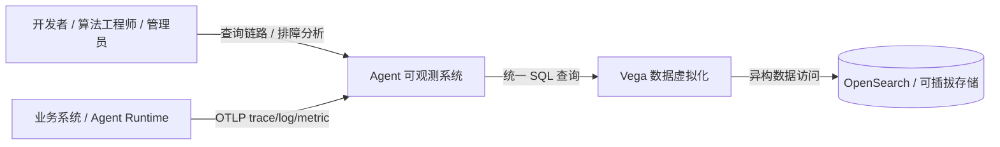
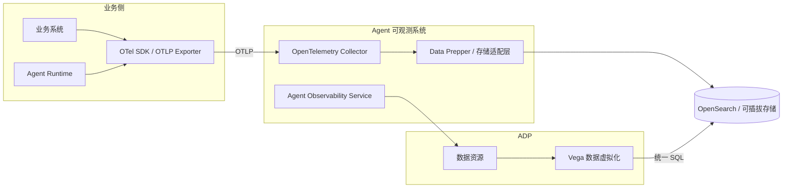
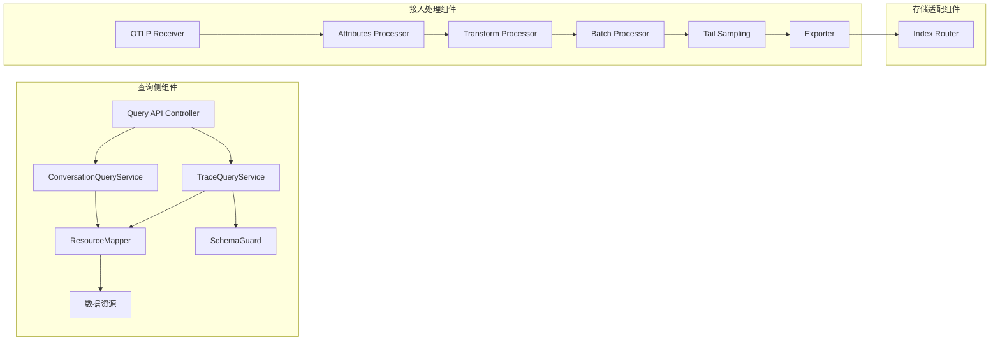
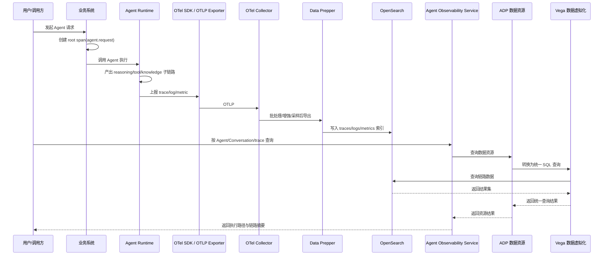
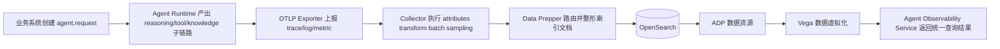
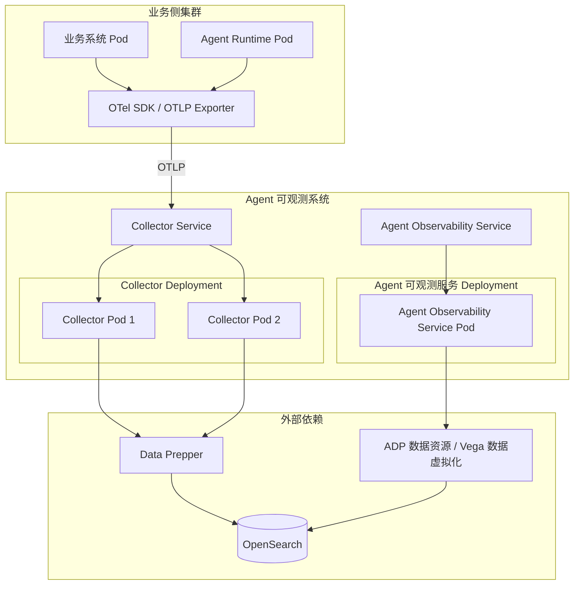
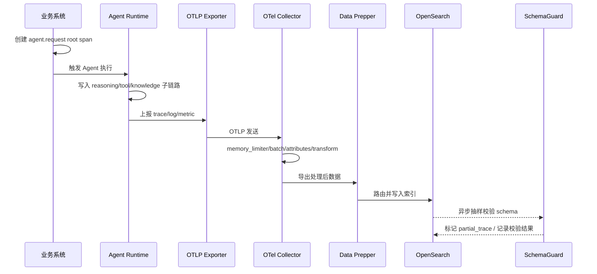
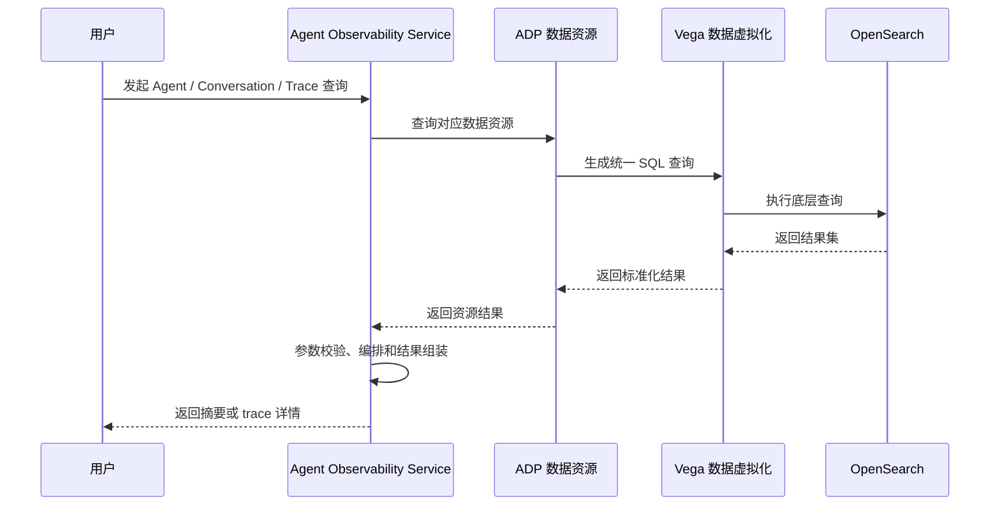
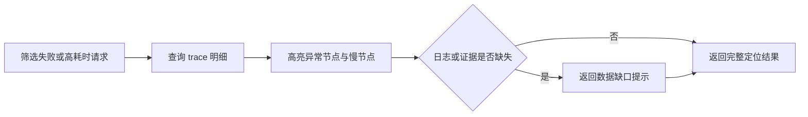

# 🏗️ Design Doc: Agent 可观测系统

> 状态: Draft  
> 负责人: evan.guo  
> 更新时间: 2026-03-18  
> PRD: [agent-tracing-system-prd.md](../prd/agent-tracing-system-prd.md)  

---

# 📌 1. 概述（Overview）

## 1.1 背景

- 当前现状：
  - 现有可观测体系主要覆盖 HTTP、RPC、数据库等传统请求链路，缺少 Agent 推理、工具选择和知识来源的统一追踪能力。
  - Agent Runtime（Dolphin）已具备模型调用、工具调用和检索增强能力，但尚未形成统一的埋点规范、采集处理链路和查询抽象。
  - 平台已明确采用 OpenTelemetry、OTLP、Collector、可插拔存储和统一查询层，为建设 Agent 专属追踪系统提供了技术底座。

- 存在问题：
  - Agent 结果错误、耗时异常或行为异常时，研发无法快速判断问题落在推理、工具还是知识检索阶段。
  - 缺少知识证据链，无法支撑结果追溯、审计和效果复盘。
  - 多业务、多 Runtime 接入时字段命名和记录粒度不一致，后续会直接影响统一查询、聚合统计和横向分析。

- 业务 / 技术背景：
  - 企业内 Agent 场景已经从单轮问答演进到多步骤自治执行，需要一套可解释、可追溯、可调试的基础设施。
  - 一期范围聚焦后端实现能力，不建设完整通用前端产品，但必须提供可被页面或工具直接调用的查询接口与统一数据模型。

---

## 1.2 目标

- 建立基于 OpenTelemetry 的 Agent 四层链路统一记录规范，覆盖请求链路、推理链路、工具链路、知识链路。
- 打通从业务埋点、OTLP 接入、Collector 处理、存储落地到统一查询接口的端到端链路。
- 支持按 Agent、Conversation、对话轮次和时间范围查询链路数据，并能基于 `trace_id` 返回完整执行路径和证据摘要。
- 使新产生的 trace 数据在 5 分钟内可查询比例达到 95% 以上，查询服务成功率达到 99% 以上。
- 为后续执行可视化、调试分析、租户治理和回放能力预留稳定的数据模型。

---

## 1.3 非目标（Out of Scope）

- 不建设完整的通用 Observability 可视化产品，仅定义后端查询接口和可承载 UI 的结果模型。
- 不实现完整 Execution Replay，只保留相关数据字段和演进位。
- 不实现模型质量自动评估能力，如 hallucination score、faithfulness 评分。
- 不绑定单一存储产品实现，但一期优先支持 OpenSearch 落地。

---

## 1.4 术语说明（Optional）

| 术语 | 说明 |
|------|------|
| Agent 四层链路 | 请求链路、推理链路、工具链路、知识链路四类可观测语义 |
| OTLP | OpenTelemetry Protocol，用于 trace、log、metric 的统一传输 |
| Collector | OpenTelemetry Collector，负责接收、处理、采样、增强和导出遥测数据 |
| Vega 数据虚拟化 | 为异构数据源提供统一的 SQL 接口，将应用程序与底层数据库实现解耦 |
| 数据资源 | 基于 Vega 提供异构数据统一查询能力的资源抽象层 |
| partial_trace | 链路字段缺失或子链路缺失，但仍被接收和可查询的非完整 trace |

---

# 🏗️ 2. 整体设计（HLD）

> 本章节关注系统“怎么搭建”，不涉及具体实现细节

---

## 🌍 2.1 系统上下文（C4 - Level 1）

### 参与者
- 用户：开发者、算法工程师、平台管理员、SRE
- 外部系统：业务系统、Agent Runtime（Dolphin）、工具服务
- 第三方服务：OpenTelemetry 生态组件、OpenSearch（一期优先）、可替换存储后端

### 系统关系

    开发者/算法/管理员 → Agent 可观测系统 → Vega 数据虚拟化 → OpenSearch/可插拔存储
    业务系统/Agent Runtime → OTLP → Agent 可观测系统



系统边界说明：
- 本系统负责 Agent 链路数据的规范定义、接收处理、存储路由、统一查询和聚合分析接口。
- 业务系统和 Agent Runtime 负责按规范产出 OTel 数据，不由本系统做首次领域语义翻译。
- 本系统一期不包含权限中心、鉴权、审计和字段级访问控制能力。

---

## 🧱 2.2 容器架构（C4 - Level 2）

| 容器 | 技术栈 | 职责 |
|------|--------|------|
| Agent Observability Service | Go / HTTP API | 对外提供 Agent、Conversation、Trace 查询接口，内部承载查询编排、数据组装、异常高亮和结果转换 |
| Collector | OpenTelemetry Collector | 接收 OTLP 数据，执行批处理、限流、属性增强、采样、过滤和导出 |
| Processor | Data Prepper（OpenSearch 路径）/ Core 内聚合模块 | 执行存储侧整形、路由、派生指标与 OpenSearch 索引组织 |
| Storage | OpenSearch | 存储 trace/log/metric 索引、证据摘要和结构化摘要内容 |

---

### 容器交互

    业务系统/Agent Runtime → OTLP Exporter → Collector → Processor/Data Prepper → Storage
    Agent Observability Service → ADP 数据资源 → Vega 数据虚拟化 → Storage



容器划分原则：
- 接入面与查询面解耦，避免业务系统感知底层存储 DSL。
- Collector 只做协议统一、基础增强和路由，不承载首次领域建模。
- Agent 可观测系统只承载采集、处理和查询编排能力；数据资源与 Vega 数据虚拟化属于 ADP 外部能力。
- OpenSearch 路径优先通过 Data Prepper 处理索引路由和文档整形；异构查询统一通过 ADP 的 Vega 数据虚拟化适配。

---

## 🧩 2.3 组件设计（C4 - Level 3）

### 查询服务组件

| 组件 | 职责 |
|------|------|
| Query API Controller | 接收查询请求，完成参数校验和错误码映射 |
| TraceQueryService | 负责 trace 明细、链路树、时间线和异常节点查询编排 |
| ConversationQueryService | 负责 Agent 列表、Conversation 列表、轮次列表和摘要查询 |
| ResourceMapper | 将底层 trace/log/metric 结果映射为统一资源模型与数据资源结果 |
| SchemaGuard | 校验公共字段完整性，标记 `partial_trace` 和 schema 合规状态 |

### Collector 组件

| 组件 | 职责 |
|------|------|
| OTLP Receiver | 接收 trace、log、metric 三类数据 |
| Attributes Processor | 注入环境、租户、服务元数据和统一标签 |
| Transform Processor | 标准化少量公共字段、兼容历史字段别名 |
| Batch Processor | 控制批量发送，降低写入抖动 |
| Memory Limiter | 防止 Collector 因突发流量失稳 |
| Tail Sampling | 对 traces 执行按错误、高时延、租户规则采样 |
| Exporter | 导出到 Data Prepper、通用存储或调试链路 |

### 存储适配组件

| 组件 | 职责 |
|------|------|
| Index Router | 按信号类型、租户、日期路由目标索引 |



---

## 🔄 2.4 数据流（Data Flow）

### 主流程

    用户请求 → 业务系统创建 root span(agent.request) → Agent Runtime 产出 reasoning/tool/knowledge 子链路
    → OTLP Exporter 发送 trace/log/metric → Collector 接收并增强字段
    → Data Prepper/存储适配层落库并建立索引 → 查询服务按业务对象检索 trace
    → 返回执行路径、异常摘要和链路详情



主流程说明：
1. 业务系统收到用户请求后创建 `agent.request` root span，并写入 `agent.id`、`agent.session.id`、`conversation.id`、`turn_id` 等公共字段。
2. Agent Runtime 在推理、工具调用、知识检索、结果生成阶段继续创建子 span 或事件，并补充对应语义属性。
3. OTLP Exporter 将 trace、log、metric 发送到 Collector。
4. Collector 执行基础增强、兼容转换、批处理和采样后导出到存储链路。
5. 查询服务基于 Agent、Conversation、轮次或 `trace_id` 反查底层数据并组装成统一结果模型。

### 子流程（可选）



---

## ⚖️ 2.5 关键设计决策（Design Decisions）

| 决策 | 说明 |
|------|------|
| 统一采用 OTel + OTLP | 避免业务系统分别适配多套接收端，保证接入路径一致，降低接入成本 |
| 领域语义前置到埋点侧 | Agent 四层链路语义由接入 SDK 和 Runtime 直接产出，避免 Collector 成为领域转换瓶颈 |
| Collector 保持轻量 | Collector 只承担接收、基础增强、采样和路由，复杂索引整形放到 Data Prepper 或存储适配层 |
| 查询层二次抽象 | 通过 Agent Observability Service + Vega 数据虚拟化隐藏底层数据库实现，保留后端替换空间 |
| 大字段摘要化存储 | prompt、response、证据正文在一期仅保存摘要和必要结构化字段，暂不引入对象存储链路 |
| 以 OpenSearch 为一期主路径 | 满足一期落地速度，同时通过 Query Adapter 保持未来扩展到其他后端的能力 |
| 一期聚焦链路能力 | 优先打通采集、存储和查询主路径，权限和审计能力后续按平台要求补齐 |

---

## 🚀 2.6 部署架构（Deployment）

- 部署环境：K8s
- 拓扑结构：业务侧服务直接通过 OTLP 上报到集中部署的 Collector Gateway；Agent 可观测服务作为统一查询与编排服务独立部署；OpenSearch、ADP、Vega 数据虚拟化作为外部依赖，不纳入本服务部署设计范围
- 扩展策略：Collector 使用 Deployment 多副本水平扩展；Agent 可观测服务使用单个 Deployment 部署并按后续流量增长扩展副本数

推荐拓扑：
1. 业务侧 Pod 内使用 OTel SDK 或自动埋点，sidecar-less 直连 Collector Gateway。
2. Collector 使用 Deployment 多副本无状态部署，前置 Service 或内部负载均衡，对外提供统一 OTLP 接入点。
3. Agent 可观测服务作为单独 Deployment 部署，内部承载统一查询入口与查询编排逻辑。
4. OpenSearch、ADP、Vega 数据虚拟化均视为外部已存在依赖，本设计只约束访问方式，不约束其部署形态。
5. Data Prepper 建议作为外部 ingest 组件独立部署，不与 Collector 或 Agent 可观测服务混部。



发布与回滚原则：
- 配置变更优先通过灰度发布 Collector pipeline 和查询服务开关完成。
- 若 Collector 配置异常，可直接回滚 Deployment 版本或恢复上一版 ConfigMap。
- 若 Agent 可观测服务查询逻辑异常，可直接回滚服务 Deployment，不影响链路采集与存储。

---

## 🔐 2.7 非功能设计

### 性能
- 单条 trace 精确查询响应时间目标为 P95 ≤ 1 秒。
- Trace 详情首屏查询目标为 P95 ≤ 2 秒。
- 查询服务设计吞吐基线为 200 QPS，并支持横向扩容。
- 对超长时间范围查询执行默认分页、时间窗限制和聚合保护，避免查询雪崩。

### 可用性
- 查询服务目标 SLA ≥ 99.9%。
- 数据接收链路目标可用性 ≥ 99.95%。
- Collector、查询服务和 Vega 数据虚拟化均采用无状态多副本部署。
- 存储超时或部分索引不可用时，优先保留明细查询能力，聚合结果允许降级。

### 安全
- 一期不包含权限中心、RBAC、审计日志和字段级访问控制设计。

### 可观测性
- tracing：一期交付，查询服务与 Collector 自身接入 OTel 链路；Agent 执行链路的关键指标和关键事件附加在 trace/span/event 中上报。
- logging：后续版本交付；当前保留设计，暂不作为一期交付范围。
- metrics：后续版本交付；当前保留设计，暂不作为一期独立信号交付范围。

---

# 🔧 3. 详细设计（LLD）

> 本章节关注“如何实现”，开发可直接参考

---

## 🌐 3.1 API 设计

### Agent 列表查询

使用已有接口，不在一期新增接口设计中重复定义。

### Conversation 列表查询

使用已有接口，不在一期新增接口设计中重复定义。

### 对话历史消息查询

使用已有接口，不在一期新增接口设计中重复定义。

### Trace 详情查询

**Endpoint:** `GET /api/v1/traces/{trace_id}`

**Request:**

```json
{}
```

**Response:**

```json
{
  "resourceSpans": [
    {
      "resource": {
        "attributes": [
          {
            "key": "service.name",
            "value": { "stringValue": "agent-observability-service" }
          },
          {
            "key": "telemetry.sdk.language",
            "value": { "stringValue": "go" }
          }
        ]
      },
      "scopeSpans": [
        {
          "scope": {
            "name": "agent-runtime",
            "version": "1.0.0"
          },
          "spans": [
            {
              "traceId": "4bf92f3577b34da6a3ce929d0e0e4736",
              "spanId": "1111111111111111",
              "name": "invoke_agent travel-assistant",
              "kind": "SPAN_KIND_INTERNAL",
              "startTimeUnixNano": "1742284195000000000",
              "endTimeUnixNano": "1742284197430000000",
              "attributes": [
                {
                  "key": "gen_ai.operation.name",
                  "value": { "stringValue": "invoke_agent" }
                },
                {
                  "key": "agent.trace.type",
                  "value": { "stringValue": "request" }
                },
                {
                  "key": "gen_ai.agent.name",
                  "value": { "stringValue": "travel-assistant" }
                },
                {
                  "key": "gen_ai.agent.description",
                  "value": { "stringValue": "负责旅行问答与工具调度" }
                },
                {
                  "key": "gen_ai.conversation.id",
                  "value": { "stringValue": "conv-1001" }
                },
                {
                  "key": "agent.request.id",
                  "value": { "stringValue": "req-20260318-001" }
                },
                {
                  "key": "agent.progress",
                  "value": {
                    "stringValue": "[{\"type\":\"llm_call\",\"name\":\"route_intent\"},{\"type\":\"skill_call\",\"name\":\"weather_search\"},{\"type\":\"llm_call\",\"name\":\"compose_answer\"}]"
                  }
                }
              ],
              "events": [
                {
                  "name": "tool_invocation_started",
                  "timeUnixNano": "1742284195200000000",
                  "attributes": [
                    {
                      "key": "agent.tool.name",
                      "value": { "stringValue": "weather_search" }
                    }
                  ]
                },
                {
                  "name": "response_composed",
                  "timeUnixNano": "1742284197410000000"
                }
              ],
              "status": {}
            },
            {
              "traceId": "4bf92f3577b34da6a3ce929d0e0e4736",
              "spanId": "2222222222222222",
              "parentSpanId": "1111111111111111",
              "name": "chat intent-router",
              "kind": "SPAN_KIND_INTERNAL",
              "startTimeUnixNano": "1742284195010000000",
              "endTimeUnixNano": "1742284195220000000",
              "attributes": [
                {
                  "key": "gen_ai.operation.name",
                  "value": { "stringValue": "chat" }
                },
                {
                  "key": "agent.trace.type",
                  "value": { "stringValue": "reasoning" }
                },
                {
                  "key": "gen_ai.provider.name",
                  "value": { "stringValue": "openai" }
                },
                {
                  "key": "gen_ai.request.model",
                  "value": { "stringValue": "gpt-4o-mini" }
                },
                {
                  "key": "gen_ai.response.model",
                  "value": { "stringValue": "gpt-4o-mini" }
                },
                {
                  "key": "agent.reasoning.step",
                  "value": { "intValue": "1" }
                },
                {
                  "key": "agent.reasoning.decision",
                  "value": { "stringValue": "需要调用天气技能获取实时结果" }
                }
              ],
              "status": {}
            },
            {
              "traceId": "4bf92f3577b34da6a3ce929d0e0e4736",
              "spanId": "3333333333333333",
              "parentSpanId": "1111111111111111",
              "name": "execute_tool weather_search",
              "kind": "SPAN_KIND_INTERNAL",
              "startTimeUnixNano": "1742284195230000000",
              "endTimeUnixNano": "1742284196830000000",
              "attributes": [
                {
                  "key": "gen_ai.operation.name",
                  "value": { "stringValue": "execute_tool" }
                },
                {
                  "key": "agent.trace.type",
                  "value": { "stringValue": "tool" }
                },
                {
                  "key": "gen_ai.tool.name",
                  "value": { "stringValue": "weather_search" }
                },
                {
                  "key": "gen_ai.tool.type",
                  "value": { "stringValue": "datastore" }
                },
                {
                  "key": "agent.tool.status",
                  "value": { "stringValue": "ok" }
                },
                {
                  "key": "agent.tool.latency_ms",
                  "value": { "intValue": "160" }
                }
              ],
              "status": {}
            },
            {
              "traceId": "4bf92f3577b34da6a3ce929d0e0e4736",
              "spanId": "4444444444444444",
              "parentSpanId": "3333333333333333",
              "name": "retrieval city-weather-kb",
              "kind": "SPAN_KIND_INTERNAL",
              "startTimeUnixNano": "1742284195300000000",
              "endTimeUnixNano": "1742284195600000000",
              "attributes": [
                {
                  "key": "gen_ai.operation.name",
                  "value": { "stringValue": "retrieval" }
                },
                {
                  "key": "agent.trace.type",
                  "value": { "stringValue": "knowledge" }
                },
                {
                  "key": "gen_ai.retrieval.query.text",
                  "value": { "stringValue": "上海今天天气" }
                },
                {
                  "key": "gen_ai.knowledge.source_id",
                  "value": { "stringValue": "weather-index-cn" }
                }
              ],
              "events": [
                {
                  "name": "knowledge_retrieved",
                  "timeUnixNano": "1742284195590000000",
                  "attributes": [
                    {
                      "key": "agent.knowledge.hit",
                      "value": { "boolValue": true }
                    }
                  ]
                }
              ],
              "status": {}
            },
            {
              "traceId": "4bf92f3577b34da6a3ce929d0e0e4736",
              "spanId": "5555555555555555",
              "parentSpanId": "1111111111111111",
              "name": "chat compose-answer",
              "kind": "SPAN_KIND_INTERNAL",
              "startTimeUnixNano": "1742284196840000000",
              "endTimeUnixNano": "1742284197420000000",
              "attributes": [
                {
                  "key": "gen_ai.operation.name",
                  "value": { "stringValue": "chat" }
                },
                {
                  "key": "agent.trace.type",
                  "value": { "stringValue": "reasoning" }
                },
                {
                  "key": "gen_ai.provider.name",
                  "value": { "stringValue": "openai" }
                },
                {
                  "key": "gen_ai.request.model",
                  "value": { "stringValue": "gpt-4o-mini" }
                },
                {
                  "key": "gen_ai.output.type",
                  "value": { "stringValue": "text" }
                },
                {
                  "key": "agent.reasoning.step",
                  "value": { "intValue": "2" }
                }
              ],
              "status": {}
            }
          ]
        }
      ]
    }
  ]
}
```

说明：
- Trace 详情接口一期仅支持按 `trace_id` 查询。
- 返回结构遵循标准 OTel TraceData 结构，即 `resourceSpans -> scopeSpans -> spans`。
- Agent 执行过程通过 span 层级表达，Dolphin `progress` 中的 `llm_call`、`skill_call`、`retrieval` 等步骤分别映射为独立 span。
- 在标准 OTel span attributes 上，补充 `gen_ai.*` 语义属性和 `agent.*` 扩展属性，用于表达 Agent 决策、工具调用、知识检索和关键事件。

接口约束：
- Agent、Conversation、历史消息相关能力直接复用已有接口，不在一期新增。
- Trace 详情接口仅支持按 `trace_id` 查询。
- 聚合分析查询接口一期不提供，后续按分析需求扩展。
- 非法参数返回 `400 INVALID_ARGUMENT`；底层查询超时返回 `504 QUERY_TIMEOUT`。
- 当 trace 子链路缺失时，仍返回标准 OTel TraceData 结构，并在异常 span 或 event 中标记不完整状态。

---

## 🗂️ 3.2 数据模型

### OTelTraceData

| 字段 | 类型 | 说明 |
|------|------|------|
| resourceSpans | array | OTel TraceData 顶层资源集合 |

### ResourceSpan

| 字段 | 类型 | 说明 |
|------|------|------|
| resource | object | 服务资源信息，如 `service.name`、`service.version` |
| scopeSpans | array | 同一 instrumentation scope 下的 spans 集合 |

### ScopeSpan

| 字段 | 类型 | 说明 |
|------|------|------|
| scope | object | instrumentation scope 信息 |
| spans | array | Span 列表 |

### Span

| 字段 | 类型 | 说明 |
|------|------|------|
| traceId | string | 全局唯一链路标识 |
| spanId | string | 当前 span 标识 |
| parentSpanId | string | 父 span 标识，root span 为空 |
| name | string | span 名称，建议使用 `invoke_agent {agent}`、`chat {stage}`、`execute_tool {tool}`、`retrieval {source}` |
| kind | string | OTel span kind，一期以 `SPAN_KIND_INTERNAL` 为主 |
| startTimeUnixNano | string | 开始时间，纳秒时间戳 |
| endTimeUnixNano | string | 结束时间，纳秒时间戳 |
| attributes | array | OTel attributes，承载 `gen_ai.*` 与 `agent.*` 字段 |
| events | array | OTel events，承载关键执行事件 |
| status | object | OTel span 状态 |

### AgentTraceAttributes

| 字段 | 类型 | 说明 |
|------|------|------|
| gen_ai.operation.name | string | GenAI 操作类型，如 `invoke_agent`、`chat`、`execute_tool`、`retrieval` |
| gen_ai.agent.name | string | Agent 名称 |
| gen_ai.agent.description | string | Agent 描述 |
| gen_ai.conversation.id | string | 对话标识 |
| gen_ai.provider.name | string | 模型或框架供应方 |
| gen_ai.request.model | string | 请求使用的模型名 |
| gen_ai.response.model | string | 响应使用的模型名 |
| gen_ai.tool.name | string | 工具名称 |
| gen_ai.tool.type | string | 工具类型，如 `function`、`datastore` |
| gen_ai.retrieval.query.text | string | 检索查询语句 |
| gen_ai.output.type | string | 输出类型，如 `text`、`json` |
| agent.trace.type | string | Agent 链路类型，枚举值为 `request`、`reasoning`、`tool`、`knowledge` |
| agent.session.id | string | 会话标识 |
| agent.request.id | string | 请求标识 |
| agent.user.id | string | 终端用户标识 |
| agent.progress | string | Dolphin progress 的序列化表达，用于保留 llm/skill 等执行阶段摘要 |
| agent.mode | string | 运行模式，如 `chat`、`explore` |
| agent.reasoning.step | int | 推理步骤序号 |
| agent.reasoning.kind | string | 推理类别，如规划、反思、决策 |
| agent.reasoning.decision | string | 决策摘要 |
| agent.tool.name | string | 工具名称 |
| agent.tool.type | string | 工具类型 |
| agent.tool.status | string | 工具执行状态 |
| agent.knowledge.source_type | string | 知识来源类型 |
| agent.knowledge.source_id | string | 知识来源标识 |
| agent.knowledge.url | string | 证据链接 |
| agent.knowledge.score | double | 证据评分 |

## 💾 3.3 存储设计

- 存储类型：OpenSearch
- 数据分布：
  - traces 索引存储 span 主体和公共属性
  - logs 索引存储结构化日志、错误明细和辅助摘要信息
  - metrics 索引存储请求量、时延、错误率和派生指标
- 索引设计：
  - 按信号类型 + 日期分索引，格式为 `agent-traces-2026.03.18`
  - 高频过滤字段建立 keyword 索引：`trace_id`、`agent_id`、`conversation_id`、`turn_id`、`agent.trace.type`、`agent.tool.name`、`status`
  - 时间字段统一使用 `start_time` 与 `timestamp` 支持范围查询

数据保留策略：
- 一期暂不在设计文档中固化 trace/log/metric 保留周期。
- schema 版本通过索引模板和字段 `schema_version` 并行管理，避免升级时破坏旧数据查询。

---

## 🔁 3.4 核心流程（详细）

### 链路写入流程



1. 业务系统收到请求，创建 `agent.request` root span，并设置 `trace_id`、`conversation_id`、`turn_id`。
2. Agent Runtime 每进入推理、工具、知识检索或结果生成阶段，就创建对应 child span，并写入语义属性。
3. 对于 prompt、response、证据正文等大字段，一期仅写入摘要、哈希或裁剪后的结构化内容。
4. OTLP Exporter 发送 trace、log、metric 到 Collector。
5. Collector 执行 `memory_limiter`、`batch`、`attributes`、`transform` 和可选 `tail_sampling`。
6. 导出链路把数据发送至 Data Prepper 或通用存储 exporter。
7. Data Prepper 执行索引路由、文档整形和派生字段补充后写入 OpenSearch。
8. SchemaGuard 异步扫描缺失关键字段的记录，补充 `partial_trace` 标记并上报告警。

### 业务对象查询流程



1. 用户按 Agent 或时间范围调用查询接口。
2. Agent Observability Service 校验参数并构造查询上下文。
3. ConversationQueryService 将业务查询转换为统一资源查询条件。
4. Vega 数据虚拟化访问底层存储，返回 Agent 列表、Conversation 列表或轮次列表。
5. 当用户点击轮次时，系统根据 `trace_id` 调用 TraceQueryService 查询 trace 明细。
6. TraceQueryService 合并 trace、相关 logs 和 metrics，构造时间线和树状结构。
7. 查询结果统一按标准摘要结构返回。

### 问题定位流程



1. 用户筛选失败或高耗时请求。
2. TraceQueryService 查询 trace 明细并高亮 `status=error` 或耗时超过阈值的节点。
3. 若日志或证据缺失，则返回数据缺口提示，并保留已有链路展示。

---

## 🧠 3.5 关键逻辑设计

### Schema 校验与兼容
- 请求链路必须具备 `trace_id`、`span_id`、`agent_id`、`conversation_id`、`turn_id`、`agent.trace.type=request`。
- 推理、工具、知识链路必须具备 `parent_span_id`，确保可回溯到根链路。
- `agent.trace.type` 为 Agent 领域必填属性，用于标识 span 属于 `request`、`reasoning`、`tool`、`knowledge` 中的哪一类链路。
- `agent.trace.type` 与 `gen_ai.operation.name` 组合使用：前者表达业务链路分类，后者表达标准化操作语义。例如 `gen_ai.operation.name=chat` 可对应 `agent.trace.type=reasoning`，`gen_ai.operation.name=execute_tool` 对应 `agent.trace.type=tool`。
- 对历史系统允许使用字段别名映射，如 `session_id -> agent.session.id`，但兼容表必须版本化管理。
- 关键字段缺失时不丢弃数据，统一标记为 `partial_trace` 并产出 `schema_validation_failed` 事件。

### Trace 明细组装
- Root span 作为详情主入口，按 `start_time` 排序构造时间线。
- 通过 `span_id` 和 `parent_span_id` 重建树状结构。
- tool 和 knowledge 节点优先展示摘要字段。
- 当某一步数据解析失败时，仅标记异常节点，不阻断整条 trace 返回。

### 采样与成本控制
- 错误链路、高耗时链路和试点 Agent 默认全量保留。
- 成功链路允许按租户、Agent 或请求量执行尾采样，采样规则由配置中心下发。
- 大字段正文不进入索引，避免 OpenSearch 写放大和查询延迟恶化。

---

## ❗ 3.6 错误处理

- `INVALID_ARGUMENT`：查询参数非法、时间范围超限、分页参数异常，返回 400 并提示可用过滤条件。
- `QUERY_TIMEOUT`：底层存储查询超时，返回 504，并记录查询耗时、索引、过滤条件摘要。
- `STORAGE_UNAVAILABLE`：存储不可用或索引缺失，返回 503，并触发告警。
- `SCHEMA_VALIDATION_FAILED`：链路字段不合规，记录告警并把结果标记为 `partial_trace`。
- `PIPELINE_EXPORT_FAILED`：Collector 或 Data Prepper 导出失败时重试并输出错误日志，不允许静默丢数。

---

## ⚙️ 3.7 配置设计

| 配置项 | 默认值 | 说明 |
|--------|--------|------|
| query.default_page_size | 20 | 查询接口默认分页大小 |
| query.max_page_size | 200 | 查询接口单次最大分页 |
| query.max_time_range_hours | 168 | 单次查询允许的最大时间范围 |
| query.trace_timeout_ms | 1000 | 单条 trace 查询超时阈值 |
| query.detail_timeout_ms | 2000 | trace 详情查询超时阈值 |
| collector.tail_sampling.enabled | true | 是否启用 trace 尾采样 |
| collector.tail_sampling.error_keep_ratio | 1.0 | 错误 trace 保留比例 |
| collector.tail_sampling.success_keep_ratio | 0.2 | 成功 trace 默认采样比例，实际值按租户覆盖 |
| schema.version | v1 | 当前埋点 schema 版本 |
| schema.compat_alias.enabled | true | 是否启用历史字段别名兼容 |
| storage.trace_index_prefix | agent-traces | trace 索引前缀 |
| storage.log_index_prefix | agent-logs | 日志索引前缀 |
| storage.metric_index_prefix | agent-metrics | 指标索引前缀 |

---

## 📊 3.8 可观测性实现

- tracing：
  - 对查询服务、Vega 数据虚拟化调用做内部 span 埋点。
  - 关键 span 包括 `trace.query.by_id`、`trace.query.by_conversation`、`analysis.tool.failure`。
  - 当下游查询超时或降级时，在 span 中记录 `error=true`、`degrade=true` 和错误摘要。
  - 一期关键指标和事件不通过独立 metrics/logging 信号上报，而是附加在 trace 数据中。
  - 建议在 span attributes 或 span events 中附加以下关键信息：`agent.tool.name`、`agent.tool.status`、`agent.tool.latency_ms`、`agent.reasoning.step`、`agent.knowledge.hit`、`agent.error.code`、`agent.error.message`。
  - 典型事件包括：`schema_validation_failed`、`tool_invocation_started`、`tool_invocation_finished`、`knowledge_retrieved`、`response_composed`。

- metrics：
  - 后续版本交付，作为独立 metrics 信号补充建设。
  - `agent_trace_ingested_total`：链路接收总量，维度包括租户、Agent、schema 版本。
  - `agent_trace_partial_total`：非完整链路数量，维度包括缺失字段类型。
  - `agent_trace_query_total`：查询次数，维度包括接口、状态码、租户。
  - `agent_trace_query_latency_ms`：查询延迟直方图，维度包括接口和结果状态。
  - `agent_tool_error_total`：工具调用错误总量，维度包括工具名、错误码、Agent。
  - `schema_validation_failed_total`：schema 校验失败总量，维度包括字段名和接入方。

- logging：
  - 后续版本交付，作为独立 logging 信号补充建设。
  - 结构化日志记录接入错误、查询错误和导出重试。
  - 日志必须带 `trace_id`、`agent_id`、`conversation_id` 等关联字段。

