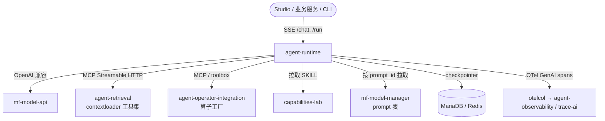

# 平台内置 Agent Runtime 技术设计文档

> **状态**：草案
> **负责人**：@sh00tg0a1
> **日期**：2026-07-12
> **相关 Ticket**：[#202](https://github.com/openbkn-ai/bkn-foundry/issues/202)

---

## 1. 背景与目标 (Context & Goals)

Decision Agent 退役后，平台没有第一方 Agent 运行时，BYO-Agent 是唯一接入模式。平台内部（Studio、业务服务、运营工具）各自需要 agent 能力时，只能重复实现 agent loop、会话管理与监控。

**定位**：agent-runtime 的用户是**平台内部开发者与模块**，不是最终用户。接口、SDK、文档以开发者体验为先——目标是引一个包、几行代码即可发起调用；不承载 to-C 产品语义（界面、用户运营、计费）。文中「调用方」均指内部模块/开发者。

- **目标**：
  1. 提供平台共用的 `agent-runtime` 服务，统一承载内部 agent 的定义、执行、会话与监控。
  2. 支持对话模式与一次性模式两种执行形态，且一次性任务可作为工具被对话 agent 调用（agent-as-tool）；两种形态均可加载 capabilities-lab 技能。
  3. 提示词外置于 mf-model-manager，可热更新；执行链路可观测（OTel → agent-observability / trace-ai），上下文可持久化与恢复。
  4. 平台其他模块低成本接入：契约先行（OpenAPI），提供 Go / Python / TypeScript 三语言 SDK；已发布 agent 自动暴露为 MCP 工具，MCP 客户端零 SDK 接入。
- **非目标 (Non-Goals)**：
  - 不复活 Decision Agent，不改变 BYO-Agent 接入模式；agent-runtime 本身以 BYO-Agent 姿态接入。
  - 不面向最终用户：不做产品界面与 to-C 语义（headless API 先行，Studio 若对接另立 issue）。
  - 不修改 agent-operator-integration / agent-retrieval 现有契约。
  - 不做租户级计费与配额。

## 2. 方案概览 (High-Level Design)

新增独立服务 `agent-runtime`（Python，LangGraph 作为编排引擎），复用平台既有能力面：模型走 mf-model-api（OpenAI 兼容），工具走 MCP（agent-retrieval 内置工具集 + 算子工厂 toolbox），技能来自 capabilities-lab，提示词来自 mf-model-manager，可观测走 otelcol → agent-observability。

### 2.1 系统架构图



### 2.2 执行形态

| 形态 | 载体 | 状态 | 工具面 |
| --- | --- | --- | --- |
| 对话模式 | 带 checkpointer 的 LangGraph graph | 多轮会话，断点可恢复 | MCP 工具 + SKILL 注入 + agent-as-tool |
| 一次性模式 | 无状态单次 graph run | 任务级（task_id 可查询） | prompt 模板 + 单次/少量 MCP 调用 |

一次性 agent 在注册时声明输入/输出 schema，runtime 自动将其包装为对话 agent 可见的工具（LangGraph agent-as-tool / 子图），实现多 agent 组合。

## 3. 详细设计 (Detailed Design)

### 3.1 核心逻辑 (Core Logic)

**Agent 定义**（存 DB，CRUD 管理）：

```text
agent := {
  agent_id, name, mode: chat | task,
  prompt_id,            -- 指向 mf-model-manager prompt 表
  prompt_vars_schema,   -- 变量填充 schema
  model,                -- 默认为空，走系统默认模型
  tools: [mcp_endpoint | toolbox_ref | agent_ref],  -- agent_ref = agent-as-tool
  skills: [capability_id],
  limits: { max_turns, max_tool_calls, timeout_s }
}
```

**对话流程**：`POST /chat` → 加载 agent 定义 → 拉取 prompt（按 prompt_id，带短 TTL 缓存，失效即热更新）→ 组装 graph（system prompt + SKILL + MCP 工具 + agent-as-tool）→ 带 thread_id 执行，checkpointer 每步落盘 → SSE 流式返回。

**一次性流程**：`POST /run` → 创建 task 记录（pending）→ 异步执行单次 graph run（同样含 SKILL 注入与 MCP 工具）→ 状态机 pending → running → succeeded / failed（含 failure_detail）→ `GET /tasks/{id}` 查询。

**互调**：对话 graph 中的 agent_ref 工具触发时，runtime 内部走与 `/run` 相同的执行路径，task 记录同样落库（parent_thread_id 关联），保证被调用的一次性任务同样可监控。

**技能加载**（一等能力，两种模式均支持）：

- 来源：capabilities-lab，按 capability_id 引用；两级挂载——agent 定义级 `skills` + 请求级 `skills[]`（`/chat`、`/run` body 附加，合并去重）。
- 渐进式注入：默认只把 SKILL 元信息与正文注入 system prompt；skill 附带的大体积资源（脚本、参考文档）不进上下文，由模型经 capabilities-lab 的渐进式读取工具按需拉取——避免上下文膨胀（get_kn_detail 同款教训）。
- 热更新：skill 内容缓存 TTL 与 prompt 层一致（≤ 60s），capabilities-lab 中更新 skill 后下一轮生效。
- 失效处理：capability_id 不存在时明确报错，不静默跳过。

### 3.2 数据模型变更 (Data Schema)

新库 `agent_runtime`（MariaDB）：

- `t_agent`：agent 定义（见 3.1）。
- `t_task`：task_id、agent_id、status、input、output、failure_detail、parent_thread_id、时间戳。状态语义对齐 vega build-task 的教训：completed 必须等于结果可用。
- `t_prompt_override`：agent_id + account_id（唯一键）→ prompt 正文 + 更新时间。调用方级提示词覆写，account 间互不可见。
- checkpointer 表：LangGraph checkpoint 序列化存储（社区 MySQL saver 或 Redis saver，M2 落定）。

数据保留：checkpoint 与 task 记录默认保留 30 天，定期清理（后续可配）。

### 3.3 接口定义 (Interface Definition)

公开路由 `/api/agent-runtime/v1/`：

| 方法 | 路径 | 说明 |
| --- | --- | --- |
| POST/GET/PUT/DELETE | `/agents`, `/agents/{id}` | Agent 定义 CRUD |
| POST | `/chat` | 对话（SSE 流式；body: agent_id, thread_id?, message） |
| POST | `/run` | 一次性任务（body: agent_id, input）→ task_id |
| GET | `/tasks/{id}` | 任务状态与结果 |
| GET | `/threads/{id}` | 会话历史 |
| GET/PUT/DELETE | `/agents/{id}/prompt` | 调用方提示词覆写（按 account 隔离；GET 返回生效值及来源层级） |

鉴权（**仅内部，硬约束**）：调用主体只有两类——平台模块（服务身份，bkn-safe app account / `/in` 约定透传 x-account-id / x-account-type）与内部工程师（bkn-safe token 或 bak_ AppKey，供脚本/CLI）。**不接受终端用户流量**：网关不为 agent-runtime 开 to-C 入口；若未来 Studio 等产品面需要 agent 能力，由其后端以服务身份代理调用，终端用户身份不直达本服务。对下游服务调用遵循 `/in` 路由约定（信 header，授权押下游）。

### 3.4 提示词集成

提示词按三层解析，高层覆盖低层，逐层回退：

1. **请求级**：`/chat`、`/run` body 可带 `prompt_override`（仅本次调用生效，不落库）。
2. **调用方级**：`PUT /agents/{id}/prompt` 写入 `t_prompt_override`，按 account_id 隔离——调用方 A 的覆写对 B 不可见，也不影响平台默认。
3. **平台默认**：agent 定义中的 prompt_id，runtime 调 mf-model-manager `GET /api/mf-model-manager/v1/prompt/{prompt_id}` 取正文（管理员在 mf-model-manager 维护；其 prompt_completion 接口处于注释状态，不依赖、不恢复）。

- 变量填充统一由 runtime 本地完成，三层使用同一 `prompt_vars_schema` 校验，覆写文本缺变量时报明确错误。
- 平台默认层缓存 TTL ≤ 60s；覆写层写库即生效。编辑任何一层无需重启。

### 3.5 可观测

- OTel GenAI semantic conventions：每轮 LLM 调用、每次工具调用、每个 task 出 span，经 otelcol 进 agent-observability；trace-ai 可按 trace_id 诊断。
- 采用现成 LangChain/LangGraph OTel instrumentation（openinference 系），不自研埋点层。

### 3.6 SDK 与模块接入面

所有执行、会话、监控都由 agent-runtime 服务承载；SDK 只是薄客户端，不引入第二个服务。

**契约先行**：`docs/api/agent-runtime.yaml`（OpenAPI 3.1）是唯一事实源，M1 交付物之一；`/chat` 的 SSE 事件流格式在 spec 扩展字段中定义。

**三语言 SDK**（覆盖平台全部模块栈）：

| 语言 | 落点 | 消费方 | 形态 |
| --- | --- | --- | --- |
| Go | bkn-comm-go 新增 `agentruntime` 包 | bkn-backend、vega、operator-integration 等 adp 服务 | oapi-codegen 生成 + 手写 SSE 流封装 |
| Python | bkn-comm-py 新增 `agent_runtime` 模块 | mf-model-*、脚本/examples | codegen + 手写流封装 |
| TypeScript | bkn-sdk 新增 client（openbkn CLI 顺带获得 `agent` 子命令） | bkn-studio、CLI 用户 | 同上 |

SDK 表面统一为五个动作：`chat()`（流式）、`run()` / `wait_task()`、`get_thread()`、`set_prompt()` / `get_prompt()`（调用方覆写）、agents CRUD；`chat()` / `run()` 均接受请求级 `skills` 与 `prompt_override` 参数。鉴权两态：平台内服务走 `/in` 约定透传 x-account-id / x-account-type；平台外走 bkn-safe token 或 bak_ AppKey。

**DX 验收**（服务对象是内部开发者，以此为准绳）：模块引入 SDK 后 ≤ 5 行代码完成一次 `chat()` 或 `run()`；SDK 附带最小可运行示例；错误信息带 code / description / solution（对齐平台错误规范）。

**MCP 面（零 SDK 接入）**：标记为 published 的 agent 由 runtime 自动包装为 MCP 工具，复用 agent-retrieval 同款 ToolDependencySync 机制注册进算子工厂 toolbox。已经是 MCP/toolbox 客户端的模块（以及外部 BYO-Agent）无需引 SDK 即可调用。

## 4. 边界情况与风险 (Edge Cases & Risks)

- **并发会话写冲突**：同一 thread_id 并发 /chat 请求需串行化（thread 级锁或乐观冲突拒绝）。
- **工具调用失败**：MCP 调用超时/错误进入 graph 错误分支，反馈给模型重试或终止；task 落 failed + failure_detail，不得静默吞错（vega worker 教训）。
- **提示词被删**：prompt_id 失效时 agent 拒绝执行并报明确错误，不回退到内置默认词；调用方覆写被删则自然回退到平台默认层。
- **覆写越权**：`/agents/{id}/prompt` 只允许写本 account 的覆写；空 account 一律 fail-closed（对齐 vega `/in` 授权教训）。覆写主体是模块/工程师身份，不存在终端用户维度的覆写。
- **误暴露为 to-C 入口**：本服务定位仅内部（见第 1 节），部署与网关配置须保证终端用户流量不可直达；评审与上线检查项都要含此项。
- **循环互调**：agent-as-tool 存在 A→B→A 环风险，执行栈带深度上限（默认 3）。
- **向后兼容**：全新服务，无迁移负担；DB 变更走 data-migrator 标准流程（勿用 kubectl set image 绕过 pre-upgrade hook）。
- **性能**：runtime 为 IO-bound 编排层，瓶颈在下游模型/工具；SSE 长连接数与 worker 并发按部署规格压测（M6）。

## 5. 替代方案 (Alternatives Considered)

| 方案 | 结论 | 原因 |
| --- | --- | --- |
| Eino（Go） | 备选 | 栈同构、流式最强，但需自建 CheckPointStore 与 OTel handler，API 处于 v0.10 alpha 演进期，生态与人才面小 |
| OpenAI Agents SDK | 否 | Sessions 仅消息历史，无任务级断点恢复；tracing 默认外送需改造 |
| pi-agent（pi-mono） | 否 | 单用户本地 harness 定位，会话为本地 JSONL，MCP 与多 agent 依赖第三方扩展，服务化粘合量反超 |
| Claude Agent SDK | 否 | 绑定 Anthropic 模型，与平台 BYO-model（mf-model-api）冲突 |
| 完全自研 | 否 | 重复造 agent loop / checkpoint / 多 agent，无社区红利 |

选择 LangGraph：checkpointer、MCP adapter、agent-as-tool、OTel instrumentation 全部现成，平台已有 Python 服务先例（mf-model-*），落地粘合成本最小。

## 6. 任务拆分 (Milestones)

- [ ] M1 本设计文档评审通过（含 API 契约与数据模型）
- [ ] M2 runtime 骨架：/agents CRUD + /chat 对话 + checkpointer 持久化（MariaDB/Redis 选型落定）
- [ ] M3 一次性模式：/run + /tasks + agent-as-tool 互调
- [ ] M4 提示词集成：mf-model-manager 拉取 + 变量填充 + 热更新
- [ ] M5 可观测：OTel spans → agent-observability，trace-ai 诊断验证
- [ ] M6 Helm chart + deploy.sh 集成 + VM（10.211.55.4）部署验证
- [ ] M7 接入面：OpenAPI 契约冻结 → Go/Python/TS SDK（bkn-comm-go / bkn-comm-py / bkn-sdk）+ published agent 注册为算子工厂 MCP 工具

每阶段验收标准见 Epic #202 验收清单；失败条件同 Epic。
