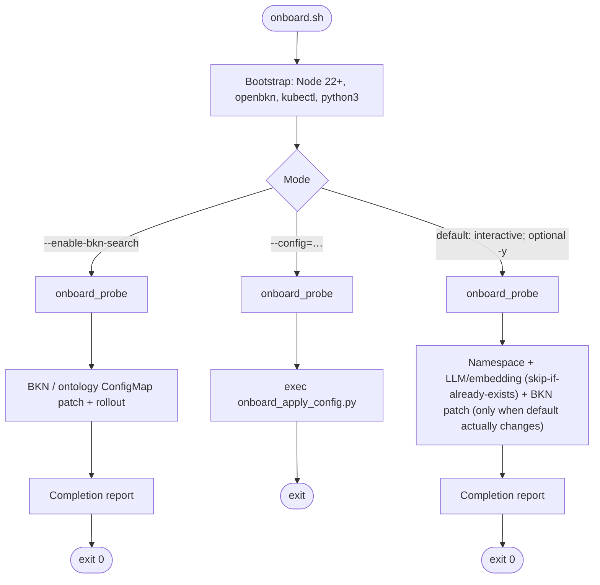
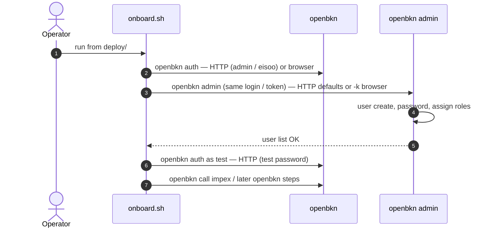

# 🚢 Ship and deploy

This page covers **prerequisites**, **install steps**, and **post-install checks** for BKN Foundry.

> **Platform:** **Linux** is the recommended install target for full stacks (`preflight.sh`, k3s/kubeadm, data services). **macOS** is supported only for **local dev validation** with Docker + **kind** — see [`deploy/dev/README.md`](../../deploy/dev/README.md) ([`README.zh.md`](../../deploy/dev/README.zh.md) in Chinese) and `deploy/dev/mac.sh` (no `preflight.sh` / production parity on the Mac host). Typical flow: start **Docker Desktop** (or any engine that exposes the Docker API), **`bash ./dev/mac.sh cluster up`**, then **`bash ./dev/mac.sh bkn-foundry install`** — `install_core` runs **`ensure_data_services`** first (same Helm bundle as `data-services install`) unless **`KWEAVER_SKIP_DATA_SERVICES_BUNDLE=true`**.

> Use the `deploy.sh` script under the `deploy/` directory from your product bundle or build tree.

> **`deploy.sh` global flags** (`--distro=k3s|k8s`, `-y`, `--force-upgrade`, `--config=…`, …) are parsed only when they appear **before** the module, e.g. `bash ./deploy.sh --distro=k8s bkn-foundry install --minimum`. A trailing `... install --minimum --distro=k8s` is **not** applied as distro. Use `export KUBE_DISTRO=k8s` for the same effect, or move `--distro` forward (same rule as `-y` / `--force-upgrade`).

---

## 🧱 Prerequisites

Prepare the host, network, and client tooling before you deploy.

### Host requirements

> Run installation as `root` or with `sudo`.

| Item | Minimum | Recommended |
| --- | --- | --- |
| OS | **Ubuntu Server** **22.04 LTS or later**, **Rocky Linux / AlmaLinux / CentOS Stream** 8+, **openEuler** 23+ | Ubuntu **22.04 LTS**, or RPM-based **8+** |
| CPU | 16 cores | 16 cores |
| Memory | 48 GB | 64 GB |
| Disk | 200 GB | 500 GB |

`deploy/preflight.sh` and `deploy.sh` support both **Ubuntu/Debian** (apt) and **Rocky/Alma/CentOS Stream/openEuler** (dnf/yum) as documented in `deploy/README.md`.

### Git, Node.js, Python

| Tool | Expectation |
| --- | --- |
| **Git** | `deploy.sh` / `preflight.sh` **do not** call `git`. Install Git only if you are working from **a cloned repository**. Deployments from an **extracted product tarball** or artifact **do not** require Git on the install host. |
| **Node.js** | **22+** aligns with **`@openbkn/bkn-sdk`** npm [`engines`](https://www.npmjs.com/package/@openbkn/bkn-sdk), **`deploy/onboard.sh`**, and preflight checks (`PREFLIGHT_KWEAVER_MIN_NODE_MAJOR`, default **22**). Bringing up Kubernetes/Helm on the server **does not** require Node; preflight warns if Node is missing or older than **22** (**[WARN]** only—you can run onboard from another machine or install Node via **`preflight.sh --fix`** opt-ins). See **Client tooling** below. |
| **Python** **3** | **Optional** for normal `preflight` / `deploy.sh`. **`python3`** is **required** if you pass **`deploy/preflight.sh --output=json`** (stdout JSON is emitted via Python). When **`python3`** is on PATH, preflight **requires CPython 3.6+** (same bar as `deploy/scripts/lib/onboard_*.py`; override **`PREFLIGHT_MIN_PYTHON_MAJOR`** / **`PREFLIGHT_MIN_PYTHON_MINOR`**, default **3** / **6**). A few kubectl-related helpers also use Python when available. |

**`deploy/scripts/lib/onboard_*.py` (invoked by `onboard.sh`)** are written for **CPython 3.6 through current 3.x** — including **CentOS 7’s 3.6.x** — and avoid 3.7-only `subprocess` flags, **PEP 563** annotations, **`yaml.dump(..., sort_keys=...)`** (needs newer PyYAML), etc. **Python 3.5 and older are not supported** (f-strings, among other things). Maintainer/CI: **`bash deploy/scripts/lib/preflight_checks_test.sh`** includes a `py_compile` pass on these files when `python3` is available; set **`EXTRA_PYTHONS="python3.9 python3.12"`** to repeat with more interpreters.

### Host preparation (typical Linux)

```bash
# 1. Disable firewall (or open required ports per your policy)
systemctl stop firewalld && systemctl disable firewalld

# 2. Disable swap
swapoff -a && sed -i '/ swap / s/^/#/' /etc/fstab

# 3. SELinux permissive if needed
setenforce 0

# 4. Install container runtime (example: containerd)
# dnf install containerd.io   # adjust for your distro
```

> Exact steps depend on your OS; follow the deployment guide shipped with your release.

### Network access

The deploy scripts may need outbound access to mirrors and registries, for example:

| Domain | Purpose |
| --- | --- |
| `mirrors.aliyun.com` | RPM mirrors |
| `mirrors.tuna.tsinghua.edu.cn` | containerd RPM mirror |
| `registry.aliyuncs.com` | Kubernetes images |
| `swr.cn-east-3.myhuaweicloud.com` | BKN Foundry images |
| `repo.huaweicloud.com` | Helm binary |
| `kweaver-ai.github.io` | Helm chart repo |

### Client tooling (after deploy)

On your workstation (with network access to the cluster):

- **kubectl** — optional but useful for health checks
- **openbkn CLI** — install via npm package `@openbkn/bkn-sdk`

```bash
npm install -g @openbkn/bkn-sdk
# or: npx openbkn --help
```

> **Node.js 22+** is required. This matches the [`engines`](https://www.npmjs.com/package/@openbkn/bkn-sdk) field of `@openbkn/bkn-sdk` on npm (`node >= 22`); Node 18 will get `EBADENGINE` or runtime issues.

- **curl** — for raw HTTP API calls

---

## 📥 Enter the deploy directory

From your extracted bundle or repo:

```bash
cd deploy
chmod +x deploy.sh
```

> Adjust the path if your layout differs.

---

## 🩺 Pre-install host check / fix: `preflight.sh`

Before `deploy.sh`, run **`deploy/preflight.sh`** on the **target install host** (`root` / `sudo`). It checks kernel / sysctl / containerd / `kubectl` / `helm` / `python3` (requires **3.6+** when interpreter is on PATH) / Node / `openbkn` CLIs and can apply the missing pieces (each fix is opt-in unless `-y`):

```bash
sudo bash deploy/preflight.sh                # check-only (default; still requires root)
sudo bash deploy/preflight.sh --fix          # check + interactive fixes
sudo bash deploy/preflight.sh --fix -y       # auto-approve every fix
sudo bash deploy/preflight.sh --list-fixes   # preview which fixes would run, no changes
sudo bash deploy/preflight.sh --help         # all flags
```

Common flags:

| Flag | Meaning |
| --- | --- |
| `--check-only` | Only run checks, do not modify the system (default) |
| `--fix` | Check + apply fixes (K8s / sysctl / containerd / Helm / firewall / SELinux / system tuning / sysctl …); also offers Node 22+ + `openbkn` |
| `-y` / `--yes` | Auto-approve **every** fix prompt |
| `-n` / `--no` | Auto-decline every fix (preview risk text only) |
| `--fix-allow=LIST` | Comma-separated fix names to auto-approve, others are skipped (e.g. `k8s-pkgs-repo,k8s-bins,containerd-install,helm-v3,nofile-limits,nodejs-npm,kweaver-sdk`; legacy alias `k8s-apt-source`). Run `sudo bash deploy/preflight.sh --list-fixes` to see all fix names available on this host. |
| `--role=target\|admin\|both` | `target` = `kubectl`/`helm` only, `admin` = `openbkn` / Node / npm, `both` (default) covers all |
| `--no-recheck` | Do not re-run full checks after fixes |
| `--lenient` | Downgrade install-blocking `[FAIL]` items (sysctl / kernel modules / containerd / kubectl / helm / swap / broken apt sources / missing kubeadm or containerd install candidate / ulimit / inotify / vm.max_map_count / overlay) back to `[WARN]`. Same as `PREFLIGHT_STRICT=false PREFLIGHT_STRICT_SOURCES=false`. |
| `--skip=LIST` | Comma-separated check names to skip |
| `--report=PATH` | Append the full log to this file |
| `--output=json` | Emit JSON summary to stdout (human logs to stderr); requires `python3` |
| `--distro=k8s\|k3s` | Match `deploy.sh`: **k8s** (default, kubeadm stack) runs the stricter kubeadm-oriented checks; **k3s** skips kubeadm-repo/containerd package assumptions. Same as `KUBE_DISTRO`. On **`deploy.sh`**, `--distro` must come **before** the module (see the note at the top of this page). |

Common environment variables:

| Variable | Default | Effect |
| --- | --- | --- |
| `KUBE_DISTRO` | `k3s` | Shared with `deploy.sh`: **`k3s`** vs **`k8s`** (kubeadm stack). Legacy `kubeadm` is accepted as an alias for **`k8s`**. Set this when you cannot place `--distro` before the module on `deploy.sh`. |
| `PREFLIGHT_STRICT` | `true` | When `true`, install-blocking items that `--fix` can resolve are reported as `[FAIL]` (so `--check-only` exits `1`). Set `false` to revert to `[WARN]`. |
| `PREFLIGHT_STRICT_SOURCES` | `true` | When `true`, also verify `apt-cache policy kubeadm` / `containerd.io` / `containerd` (and the `dnf`/`yum` equivalents) actually return install candidates — `apt-get update` succeeding alone is no longer enough. |
| `PREFLIGHT_K8S_APT_MINOR` | auto | Pin the `pkgs.k8s.io` minor version (e.g. `v1.28`). Otherwise detected from installed `kubeadm`, falls back to `v1.28`. |

Exit codes: **0** all OK · **1** any FAIL present · **2** only WARN (no FAIL).

> Run preflight **before** every `deploy.sh bkn-foundry install` on a new host. Re-running it is safe — already-satisfied checks are reported as `OK` and skipped. If you intentionally run on a low-spec lab box (memory / disk below recommendation, no Docker CE repo, etc.), use `--lenient` to keep the report informative without blocking install.

### Reading the report: `Summary` and `Conclusion`

After `--check-only` or `--fix`, preflight prints a **Summary** (counts per status) and a **Conclusion** (whether the host is “ready for deploy”). The shape looks like the following (exact numbers and lines depend on your host):

```text
================================================================
  Summary
================================================================
  [OK]    …
  [WARN]  …
  [FAIL]  …
  [FIXED] …
  (initial [FAIL] before fix phase: …)

  Outstanding [FAIL] items:
    1. … (each line is one check; the text names the suggested fix, e.g. system-tuning, kernel-limits …)
    …

[INFO] Hint: most install-blocking [FAIL] items are auto-fixable — re-run: sudo bash ./preflight.sh --fix
[INFO]       Need to bypass strict severity … ? sudo bash ./preflight.sh --check-only --lenient

================================================================
  Conclusion
================================================================
  … preflight above is NOT all clear — fix that before treating deploy as ready.
  Typical loop:
    sudo bash ./preflight.sh --fix          # … (per-item y/N unless -y)
    sudo bash ./preflight.sh --check-only   # re-check until blocking [FAIL] are gone (or use --lenient)
  Only then install:
    sudo bash ./deploy.sh bkn-foundry install --minimum
    sudo bash ./deploy.sh bkn-foundry install
  Finally: sudo bash ./onboard.sh from deploy/ (Linux; macOS dev uses plain bash. Node 22+ + openbkn on PATH; sudo bash ./preflight.sh --fix helps …)
```

**Notes:**

- **`[FIXED]` stays 0** while there were initial `[FAIL]`s: often means interactive `--fix` was run with **Enter on every prompt** — the default is **no** for each fix. Use **`sudo bash deploy/preflight.sh --fix -y`**, or answer **`y`** where you want a fix applied.
- **Common Outstanding [FAIL] buckets** (map to fix names): `docker-disable` (stop Docker when it conflicts with k3s / containerd), `system-tuning` (forwarding, swap, kernel modules, `overlay`), `kernel-limits` (`vm.max_map_count` / inotify), `nofile-limits` (`ulimit -n`), `k8s-pkgs-repo` + `k8s-bins` (Kubernetes repo and `kubeadm`/`kubectl`), `containerd-install`, `helm-v3`. On **RPM** systems, if **`kubernetes.repo` excludes kube packages**, installs need **`--disableexcludes=kubernetes`**; preflight probes and `install_kubernetes` are aligned with that.
- After **`--fix`**, run **`--check-only` again** and only then proceed to **`deploy.sh`**.

For more troubleshooting and manual fallbacks, see **`deploy/README.md` → Troubleshooting**.

---

## 🚀 Install BKN Foundry

### Minimum install (recommended for first try)

Skips some optional modules (e.g. auth / business domain) for a lighter footprint:

```bash
./deploy.sh bkn-foundry install --minimum
```

Equivalent flags:

```bash
./deploy.sh bkn-foundry install --set auth.enabled=false --set businessDomain.enabled=false
```

### Full install

Includes auth and business-domain related components:

```bash
./deploy.sh bkn-foundry install
```

> The script may prompt for **access address** and detect **API server address** automatically.

### Non-interactive install

```bash
./deploy.sh bkn-foundry install \
  --access_address=<your-ip-or-domain> \
  --api_server_address=<nic-ip-for-k8s-api>
```

- `--access_address` — URL or IP clients use to reach BKN Foundry (ingress)
- `--api_server_address` — real NIC IP bound for the Kubernetes API server

### Custom ingress ports (optional)

```bash
export INGRESS_NGINX_HTTP_PORT=8080
export INGRESS_NGINX_HTTPS_PORT=8443
./deploy.sh bkn-foundry install
```

### Useful commands

```bash
./deploy.sh bkn-foundry status
./deploy.sh bkn-foundry uninstall
./deploy.sh --help
```

### What gets installed

1. Single-node Kubernetes (if needed), storage, ingress
2. Data services: MariaDB, Redis, Kafka, OpenSearch (as defined by release manifests)
3. BKN Foundry application Helm charts

> For uninstall and cluster reset, follow the operations guide bundled with your release.

---

## Post-install: `onboard.sh`

After `deploy.sh bkn-foundry install`, use **`deploy/onboard.sh`** on a machine with **Node 22+**, **`kubectl`** (cluster access), and **`openbkn`** (`npm i -g @openbkn/bkn-sdk`). Run from the `deploy/` directory **with `sudo` on Linux** (matches `sudo deploy.sh`):

```bash
cd deploy
sudo bash ./onboard.sh --help
```

> **Why `sudo`?** `onboard.sh` reads the install config at `$HOME/.openbkn-ai/config.yaml` (written by `sudo deploy.sh` into `/root/.openbkn-ai/`, mode 700) and writes `openbkn` auth state to `$HOME/.bkn`. Without `sudo`, the current user's home is consulted instead — and falls back to the vendored template `deploy/conf/config.yaml` if that file does not exist, which may resolve a **different** access URL than the one used at install time. The script prints a yellow `[onboard][hint]` at startup whenever this mismatch is likely; silence with `ONBOARD_SUDO_HINT_DISABLED=1`. **macOS dev path** (`bash deploy/dev/mac.sh onboard`) must **not** use `sudo`: Docker Desktop / `kind` / `$HOME` (install config + `openbkn` token) all belong to the current user, and `sudo` redirects them to `/var/root` — splitting install from onboard. `deploy.sh` already short-circuits `check_root` on `Darwin`, so `sudo` adds nothing on macOS. See [`deploy/dev/README.md`](../../deploy/dev/README.md) · [`deploy/dev/README.zh.md`](../../deploy/dev/README.zh.md) for details.

Typical flags:

| Flag | Meaning |
| --- | --- |
| *(none)* | Interactive: walks through Node / `openbkn` install (if missing), auth (single CLI — admin is built in via `openbkn admin`), then model / BKN / Context Loader prompts |
| `-y` / `--yes` | Auto-accept all prompts: bootstrap, ISF HTTP auth defaults (`admin` / `eisoo.com`), `test` user creation + role sync, `openbkn` relogin as `test`, Context Loader import. Skips interactive **model registration**; use `--config=models.yaml` for non-interactive model registration. |
| `--config=models.yaml` | Non-interactive: register models (and optional BKN) via YAML; see `deploy/conf/models.yaml.example` |
| `--enable-bkn-search` | BKN ConfigMap patch only (after probe) |
| `--skip-context-loader` | Skip ADP Context Loader toolbox import |

**Full ISF install (auth + business domain):** onboarding treats the cluster as "ISF" when related Helm releases or namespaces exist. **`onboard.sh` then performs the following 5 steps automatically** (you do **not** need to run them by hand — they are listed here so you know what is happening, and what to fall back to if a step fails):

1. **`openbkn auth login`** (`onboard_ensure_kweaver_auth`) — session saved under `~/.bkn`. HTTP defaults to `admin` / `eisoo.com` (or browser OAuth on a TTY); under `-y` HTTP defaults are used automatically.
2. **`openbkn` on `PATH`** (`onboard_ensure_kweaver_admin_for_isf`) — runs `npm i -g @openbkn/bkn-sdk` if missing (interactive prompt, or auto under `-y`). Admin is built in via the `openbkn admin` subcommand — no separate package.
3. **Admin auth** (`onboard_ensure_kweaver_admin_auth_for_isf`) — admin operations reuse the **same `openbkn` login / token store** as step 1 (`admin` / `eisoo.com` defaults). Uses `-u` / `-p` / `-k` (HTTP `/oauth2/signin` is selected automatically). On a TTY a browser flow is also offered.
4. **User `test`** (`onboard_offer_isf_test_user`) — created with password `111111` (override with `ONBOARD_TEST_USER_PASSWORD`), every role from `openbkn admin role list` assigned, then **`openbkn auth login` as `test`** so the SDK session matches the business user for the next steps. If `test` already exists, only role-sync runs.
5. **Context Loader + model registration** (`onboard_offer_context_loader_toolset` → `openbkn call impex`; then interactive / YAML model registration) — both use **`~/.bkn` as `test`** (the console `admin` session usually returns `403` on impex).

If any step fails, the script exits non-zero with a clear message; re-run `sudo bash deploy/onboard.sh` (Linux) / `bash deploy/onboard.sh` (macOS dev) after fixing the cause — earlier successful steps are detected and skipped (idempotent re-runs).

**Minimum install** (`--minimum`): only `openbkn auth` (often `--no-auth`); the ISF-only steps 2–4 above are no-ops (admin tasks need the auth-enabled backend), and Context Loader (step 5) only runs if the operator deployment is present.

At the end, an **English completion report** is printed unless `ONBOARD_NO_COMPLETION_REPORT=1`.

### `onboard.sh` flow (Mermaid)

**1) Entry: bootstrap, then one of three modes**



- **`onboard_probe` runs in all three modes** before BKN-only, YAML, or interactive model registration. On **ISF**, it includes **admin HTTP auth (same `openbkn` defaults)**, **user `test`**, **`openbkn` relogin as `test`**, then **Context Loader** when applicable.
- **`-y`** does not set `--config`; it mainly auto-accepts **Node / npm -g** bootstrap and **ISF** `openbkn` **HTTP** auth defaults where applicable. Under `-y` the interactive model section is skipped (use `--config=models.yaml` to register non-interactively); the completion report still shows what is already on the platform.
- **Re-runs are safe.** Interactive model registration **detects what is already there** and only asks to add more:
  - **LLM** — if any LLM is already registered, the script asks `Register another LLM now? [y/N]` (default **No**).
  - **Embedding / small model** — same pattern. If you do register a new embedding, the script then asks whether to make it the **BKN default**:
    - if a default already exists, the prompt is `Set [<new>] as the new BKN default…? [y/N]` (default **No**, since one is set).
    - if no default is set yet, the prompt is `Set [<new>] as the BKN default…? [Y/n]` (default **Yes**).
  - The **BKN ConfigMap patch + `bkn-backend` / `ontology-query` rollout restart** runs **only when you actually change the default**. If you keep the existing default, the ConfigMap is left alone and nothing is restarted.
  - YAML mode (`--config=models.yaml`) follows the same idea: per-model registration is skipped when the model already exists, and the BKN patch+restart is skipped when both ConfigMaps already declare the same `defaultSmallModelEnabled=true` / `defaultSmallModelName`.

**2) What `onboard_probe` does (linear order; non-ISF steps are no-ops or skip quickly)**

```mermaid
flowchart TB
  subgraph probe["onboard_probe"]
    A["onboard_ensure_kweaver_auth\n(openbkn: HTTP default admin / eisoo or browser)"] --> B["kubectl: ns or target namespace"]
    B --> C["onboard_prepend_npm_global_bin_to_path"]
    C --> D["onboard_recommend_admin_cli (Helm / ns → ISF?)"]
    D --> E["onboard_ensure_kweaver_admin_for_isf\n(npm -g openbkn on ISF if needed)"]
    E --> F["onboard_ensure_kweaver_admin_auth_for_isf\n(admin auth: same openbkn defaults, or -k browser; -y: auto HTTP)"]
    F --> G1["onboard_offer_isf_test_user\ncreate or sync test + roles"]
    G1 --> G2["onboard_isf_relogin…\nopenbkn auth as test (HTTP)"]
    G2 --> H["onboard_offer_context_loader_toolset\n(openbkn impex)"]
  end
```



On **minimum (non-ISF)** installs, the ISF-only steps do not require the admin backend and typically skip the **test** / **relogin** / impex gating; Context Loader may still run if the operator deployment exists.

**3) ISF full install: who talks to whom (user `test` + Context Loader impex)**



After **probe**, the default path continues with **Namespace + models + BKN** in this shell: **~/.bkn** should already be **test** on ISF so those calls use the business user.

The `openbkn` CLI and its `admin` subcommand share **one** login and token store. For impex, **`openbkn` must be signed in as `test`**, not the initial console `admin` session when the API returns 403.

---

## 🛡️ Administrator commands after a full install (`openbkn admin`)

After a full install (with `auth.enabled=true` and `businessDomain.enabled=true`), platform-level operations — **users, organizations, roles, models, audit** — are managed through the **`openbkn admin`** subcommand of the same `openbkn` CLI. There is **no separate admin package**: admin used to ship as `kweaver-admin`, but it is now merged into [`@openbkn/bkn-sdk`](https://github.com/openbkn-ai/bkn-sdk) and reached via `openbkn admin ...`:

| Command surface | Audience | Scope |
| --- | --- | --- |
| `openbkn` (`@openbkn/bkn-sdk`) | End users / Agents | BKN, Action, Skill, query, agent chat |
| `openbkn admin` (same package) | Platform administrators | Users, organizations, roles, models, audit, raw HTTP |

**When usable:** after a full install (`./deploy.sh bkn-foundry install` without `--minimum`). **On a `--minimum` install most `openbkn admin` commands return 401 / 404 — that is expected, the relevant services are not deployed.**

**Backend services it talks to:** `user-management` / `deploy-manager` / `deploy-auth` / `eacp` / `mf-model-manager` / OAuth2 (Hydra) — exactly the set enabled by a full install.

### 📥 Install

Admin is part of the `openbkn` CLI — installing `@openbkn/bkn-sdk` is enough (see [Client tooling](#client-tooling-after-deploy)). Requires **Node.js 22+**. Credentials are stored under `~/.bkn/`, shared with the regular `openbkn` commands.

```bash
npm install -g @openbkn/bkn-sdk
openbkn admin --help
```

### 🔑 Login

Admin reuses the **same `openbkn auth login`** and the same token store — there is no separate admin login:

```bash
# Browser OAuth2 (skip TLS for self-signed certs)
openbkn auth login https://<access-address> -k

# Username/password (CI / headless)
openbkn auth login https://<access-address> -u <user> -p <password> -k

# Or via environment variables (CI / headless)
export BKN_BASE_URL=https://<access-address>
export BKN_TOKEN=<bearer-token>

# Inspect session and identity
openbkn auth status
openbkn auth whoami
openbkn auth list
```

> Once signed in, every `openbkn admin ...` command uses that same session — no second login required.

### 🧰 Common admin tasks

#### Organizations (departments)

```bash
openbkn admin org tree                # tree view of departments
openbkn admin org list                # paginated list
openbkn admin org create              # create a department
openbkn admin org members <orgId>     # list members
```

#### Users

```bash
openbkn admin user list
openbkn admin user create --login alice            # default password 123456, forced change at first sign-in
openbkn admin user reset-password -u alice         # admin reset
openbkn admin user roles <userId>
openbkn admin user assign-role <userId> <roleId>
openbkn admin user revoke-role <userId> <roleId>
```

#### Roles

```bash
openbkn admin role list
openbkn admin role get <roleId>
openbkn admin role add-member <roleId> -u alice
openbkn admin role remove-member <roleId> -u alice
```

Always run **`role list` first** and use the **roleId** values from the output (role name strings such as `super_admin` / `normal_user`). For **quick start or POC**, to avoid 403s from missing roles, often assign **every** role in `role list` to a new user with one `openbkn admin user assign-role <userId> <roleId>` per entry. In **production**, grant least privilege; verify with `openbkn admin user roles <userId>`.

#### Models (LLM / Embedding)

```bash
openbkn admin llm list
openbkn admin llm add
openbkn admin llm test <modelId>

openbkn admin small-model list
openbkn admin small-model add
openbkn admin small-model test <modelId>
```

> Equivalent to invoking `openbkn call /api/mf-model-manager/...` (see [Model management](manual/model.md)); for day-to-day admin work the `openbkn admin llm` / `small-model` subcommands offer better validation and output.

#### Audit

```bash
openbkn admin audit list \
  --user alice --start 2026-04-01 --end 2026-04-30
```

#### Raw HTTP (with auth header)

```bash
openbkn admin call /api/user-management/v1/management/users -X GET
openbkn admin --json call /api/eacp/v1/... -X POST -d '{"...":"..."}'
```

### ⚠️ Things you must know

- **New users created via `user create` always start with the platform default password `123456`** and are forced to change it at first sign-in. This is documented upstream behavior of the ISF user store (`Usrm_AddUser` thrift does not accept a password parameter). Hand the account to the user over a secure channel; for lost-password rotation use `openbkn admin user reset-password`.
- **Separation-of-duties built-in accounts** — `system / admin / security / audit` must not be casually modified; operators should use **individual accounts** rather than the shared `admin` for traceable audit logs.
- **First-login forced password change (error `401001017`)**: when `openbkn auth login` hits this code, on a TTY the CLI guides you to set a new password and retries the login; in non-TTY contexts pass `--new-password '<new>'` to do it in one shot.
- **TLS:** `-k` / `--insecure` (or env var `BKN_TLS_INSECURE=1`) is for development / self-signed certs only — never use in production.
- **Capabilities not exposed by the Web console — CLI is the primary path:** department writes (`Usrm_AddDepartment` / `Usrm_EditDepartment`), user updates (`Usrm_EditUser` fallback), user-role lookup (`role list` + `role members` fallback), etc.

### 🤖 AI Agent Skill

The `openbkn` skill is a progressive-disclosure skill so AI coding assistants (Cursor, Claude Code, …) can drive both regular and admin operations on your behalf:

```bash
npx skills add https://github.com/openbkn-ai/bkn-sdk --skill openbkn
```

After installation, log in once with `openbkn auth login https://<address> -k`, then ask in natural language (or `/openbkn` slash):

```text
List all roles
Create user alice and assign every role from role list
Reset alice's password
Show alice's login audit for the last 7 days
Register an embedding model bge-m3 against https://api.siliconflow.cn
```

Skill source: [`skills/openbkn/SKILL.md`](https://github.com/openbkn-ai/bkn-sdk/blob/main/skills/openbkn/SKILL.md). The same skill covers the `openbkn admin` subcommands.

### 📖 Further reading

- [`@openbkn/bkn-sdk` repository README](https://github.com/openbkn-ai/bkn-sdk)
- [`ARCHITECTURE.md`](https://github.com/openbkn-ai/bkn-sdk/blob/main/ARCHITECTURE.md) — command tree and backend API mapping
- [`docs/SECURITY.md`](https://github.com/openbkn-ai/bkn-sdk/blob/main/docs/SECURITY.md) — tokens, TLS, audit and fallback routes
- [`skills/openbkn/SKILL.md`](https://github.com/openbkn-ai/bkn-sdk/blob/main/skills/openbkn/SKILL.md) — agent skill entry

---

## ✅ After install (check cluster and API)

When `deploy.sh bkn-foundry install` finishes, confirm the cluster and that you can reach the platform.

### Kubernetes

```bash
kubectl get nodes
kubectl get pods -A
```

> Wait until core namespaces show `Running` / `Ready` for critical workloads.

### Deploy script status

```bash
./deploy.sh bkn-foundry status
```

### CLI

```bash
openbkn auth login https://<access-address> -k
openbkn bkn list
```

> Use the same host as `--access_address` or the node IP from the installer. Omit `-k` when using a trusted TLS certificate.

### HTTP (optional)

```bash
curl -sk "https://<access-address>/health" || true
```

> Exact paths depend on your ingress and version; use OpenAPI from your environment for subsystem routes.

---

## 🧮 Optional: Etrino (dataview `--sql`)

On a **BKN Foundry–only** install, `openbkn dataview query <id>` without `--sql` usually works (paging against the view definition).

> **Ad-hoc SQL** via `openbkn dataview query --sql "..."` requires **`vega-calculate-coordinator`** in the cluster. That comes from the **Etrino** Helm stack: **`vega-hdfs`**, **`vega-calculate`** (includes the coordinator), and **`vega-metadata`**.

On a cluster where Core is already running:

```bash
./deploy.sh etrino install
./deploy.sh etrino status
./deploy.sh etrino uninstall
```

> Add `--config=/path/to/config.yaml` if needed. The flow adds the Helm repo alias **`myrepo`** (`https://kweaver-ai.github.io/helm-repo/`), labels nodes, prepares HDFS directories, and installs **`vega-hdfs` → `vega-calculate` → `vega-metadata`**. Ensure nodes have disk and resources; override `image.registry` / values when chart defaults do not match your registry.

---

## 🧠 Configure models

BKN Foundry does not include pre-configured models by default. To use **semantic search** (`openbkn bkn search`) or **agent chat**, register an LLM and an Embedding model first.

> Full details: [Model management](manual/model.md). Minimal registration example:

```bash
# Register an LLM (DeepSeek example)
openbkn call /api/mf-model-manager/v1/llm/add -d '{
  "model_name": "deepseek-chat",
  "model_series": "deepseek",
  "max_model_len": 8192,
  "model_config": {
    "api_key": "<your-api-key>",
    "api_model": "deepseek-chat",
    "api_url": "https://api.deepseek.com/chat/completions"
  }
}'

# Register an Embedding model
openbkn call /api/mf-model-manager/v1/small-model/add -d '{
  "model_name": "bge-m3",
  "model_type": "embedding",
  "model_config": {
    "api_url": "https://api.siliconflow.cn/v1/embeddings",
    "api_model": "BAAI/bge-m3",
    "api_key": "<your-api-key>"
  },
  "batch_size": 32,
  "max_tokens": 512,
  "embedding_dim": 1024
}'

# Verify
openbkn call '/api/mf-model-manager/v1/llm/list?page=1&size=50'
openbkn call '/api/mf-model-manager/v1/small-model/list?page=1&size=50'
```

> Enabling BKN semantic search also requires a ConfigMap change — see [Model management — Enable BKN semantic search](manual/model.md#enable-bkn-semantic-search).

---

## 🔧 Troubleshooting

For symptom-based recipes (CoreDNS not ready, image pull failures, missing/legacy Kubernetes apt or yum source, `containerd` cannot be installed, strict mode `[FAIL]` items, etc.) see [`deploy/README.md` → Troubleshooting](../../deploy/README.md#-troubleshooting).

Most install-blocking issues that `preflight.sh` flags as `[FAIL]` can be auto-fixed:

```bash
sudo bash deploy/preflight.sh --fix -y                         # apply every fix non-interactively
sudo bash deploy/preflight.sh --fix --fix-allow=k8s-pkgs-repo # only configure / migrate the K8s package source (legacy: k8s-apt-source)
sudo bash deploy/preflight.sh --fix --fix-allow=containerd-install
sudo bash deploy/preflight.sh --check-only --lenient           # only WARN, never FAIL (lab-box mode)
```

When in doubt, also collect:

```bash
kubectl logs -n <namespace> <pod-name>
kubectl get events -A --sort-by=.lastTimestamp | tail -50
```

---

## 📖 Next steps

| Goal | Doc |
| --- | --- |
| First commands and BKN | [Quick start](quick-start.md) |
| Model registration | [Model management](manual/model.md) |
| Enable BKN semantic search | [Enable BKN semantic search](manual/model.md#enable-bkn-semantic-search) |
