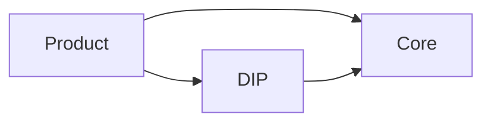

# BKN Foundry Architecture Design Specification (ARCHITECTURE)

[中文](ARCHITECTURE.zh.md) | English

This document defines the BKN Foundry architecture rules. **For day-to-day work, read Sections 1–2**. The appendix is only for terminology and copy-paste examples.

## 1. Architecture Rules (MUST)

### 1.1 Layers and dependencies

- **Core (no UI)**: Core must not include UI/Web Console/Portal/BFF. It only exposes **APIs/SDKs** and admin APIs.
  - **Exception (ISF only)**: ISF may provide **independent frontend components** (micro-frontend modules), but they must be mounted by DIP. No standalone UI entry and no built-in BFF.
- **DIP (single presentation entry)**: All UI is in DIP. DIP **requires Core at runtime**.
- **Product dependency**: Products may call DIP or Core. DIP may only call Core. No reverse dependency.
- **Component optionality**: Info Security Fabric (ISF) is optional. Except DIP base, other capability modules are optional by default and must support enable/disable with explicit UI degradation messaging (see Section 2).



### 1.2 Presentation and backend (no page-scoped BFF)

- **DIP frontend uses a monorepo (MUST)**: DIP host app, shared UI libraries, and micro-frontend modules (including Info Security Fabric frontend components) collaborate in one monorepo.
- **Allowed**: Split **micro-apps** by business and delivery boundaries (micro-frontend / micro-app modules).
- **Forbidden**:
  - Adding a dedicated backend for each page/micro-frontend module (page-scoped BFF)
  - Adding a backend microservice for each micro-app (micro-apps can be split, but backend services must not be split per micro-app)
  - Maintaining a separate frontend repository for each micro-frontend module (unless required for compliance/delivery boundaries and approved in architecture review)
- **Call paths**:
  - Browser may call Core Public APIs directly (when feasible)
  - Or use a unified API Gateway for auth pass-through and necessary protocol adaptation
  - Or use **DIP Gateway (platform-shared, optional)** for common capabilities (auth pass-through, protocol adaptation, cache, rate limiting, aggregation). It must **not** evolve into “one BFF per module/page”.

Only three kinds of “presentation-related backends” are allowed:

- **DIP Gateway (platform-shared, optional)**
  - Allowed: common auth pass-through, protocol adaptation, cache, rate limiting, aggregation (shared by multiple modules)
  - Forbidden: page-scoped endpoints; field stitching/forwarding for a single route
- **DIP module backends** (must have independent domain data and business logic)
  - Allowed modules: ChatData / AI Store / Data Semantic Governance (new modules require review approval)
  - Must not be only field mapping/stitching/aggregation; must not become a page-scoped BFF
  - Calls to Core must go through **Core Public APIs**, and must satisfy unified auth/tenant/audit requirements
- **Product-domain services** (real domain model/transactions/rules/data ownership)
  - If it is only display aggregation/query stitching/field mapping → do it in the frontend

Before adding a backend service, answer:

- Does it have persistent domain data and consistency/transaction needs?
- Does it require server-side permission/compliance logic that cannot reuse platform capabilities?
- Does it have a long-lived evolving domain model (not temporary stitching)?
- Is it reused by multiple products and not part of Core?

If all answers are “no” → do not add a new service.

### 1.3 API rules (Core Public APIs must be backward compatible)

- **API tiers**: Public / Internal / Experimental
  - Cross-component dependencies are only allowed on Public; Internal/Experimental must not be depended on across components.
- **Core backward compatibility**:
  - Core Public APIs **must be backward compatible** (no breaking changes within the same major version)
  - Any Core endpoint called by DIP/products must be treated as Public API
- **HTTP versioning**: URL major only (`/api/v1` → `/api/v2`)
  - Within the same major: only add optional fields (with default semantics), add new endpoints, extend enums (clients tolerate unknown values)
  - Breaking changes: only by introducing `/api/v2` and providing a deprecation window (e.g., 2 releases or 90 days)
- **Contract**:
  - HTTP: OpenAPI 3.1 (unified error model + pagination/filter/sort)
  - Skill: Claude Skills (tool/function calling). Must declare auth/tenant/audit and input/output schemas.

- **Compatibility definition (MUST)**:
  - **Request/Input compatibility**: older clients/callers must still work when fields are missing or use older values; do not change optional fields to required.
  - **Response/Output compatibility**: adding new fields is allowed; do not remove/rename existing fields; callers must ignore unknown fields.
  - **Behavior compatibility**: semantics must remain stable; no “same name, different meaning”.

- **Skills must be compatible too (Claude Skills)**:
  - If a Skill is used by DIP/products, treat it as **Public** and keep it backward compatible.
  - **Stable `name`**: once published, `name` must not change (renaming means a new Skill).
  - **Schema compatibility**:
    - `input_schema`: only add optional fields / extend enums (callers tolerate unknown values). Do not delete fields or change optional to required.
    - `output_schema`: only add fields. Do not delete/rename existing fields.
  - **Breaking changes**: only via a new `version` (and a new `name` if needed) with a deprecation window.
- **Change requirements**: API changes require ADR + OpenAPI diff (breaking detection) + contract tests (critical endpoints)

### 1.4 Service budget (MUST)

- **Core**: backend microservices **< 5**
- **DIP**: backend microservices **≤ 5**

Counting rules:

- Count: independently deployable/scalable backend services with their own runtime and release cadence (including DIP Gateway when enabled, DIP module backends, Core services)
- Do not count: DB/cache/message infrastructure; micro-frontend modules in the frontend monorepo; local-only mocks

Minimum enforcement:

- When adding/splitting a backend service, update the “service inventory” and provide Core/DIP counts in the PR description
- CI must include an automated count check (exceeding budget requires explicit exemption)

Exemption (must be recorded):

- Only short-term exemptions are allowed, with a consolidation plan and timeline

## 2. Mandatory checklist (MUST)

- **Dependency direction**: products/industry can call DIP or Core; DIP can only call Core; no reverse dependency
- **Core has no UI**: no React/Vue/static assets/routes/Web Console in Core repos
  - Exception (ISF only): ISF frontend components are allowed but must be mounted by DIP
- **Optional components**: disabling optional components must not prevent the system from starting; DIP UI provides explicit degradation messaging
- **APIs**: OpenAPI updated + breaking detection passed + deprecation/migration notes + contract tests
- **Backend additions**: no page-scoped BFF; any new service must pass the questions in 1.2
- **Micro-apps**: micro-apps are allowed; do not add backend microservices per micro-app (backends must be one of DIP Gateway / DIP module backends / product-domain services)
- **Monorepo**: DIP frontend uses a monorepo (including micro-apps/micro-frontends). Splitting micro-apps must not introduce new backend microservices.
- **Budget**: Core < 5, DIP ≤ 5; service inventory and counts updated

---

## Appendix: terminology and examples (optional)

### A.1 Terminology (extended)

- **Page-scoped backend / page-scoped BFF**: a backend serving only one page/route/micro-frontend module; primarily used for stitching/forwarding/permission filtering for that page.
- **DIP module backend**: a backend for a DIP capability module (ChatData / AI Store / Data Semantic Governance and approved modules), with independent domain data and business logic.
- **Micro-frontend module**: an independently built/released frontend module mounted by DIP.

### A.2 OpenAPI example (minimal snippet)

```yaml
openapi: 3.1.0
info:
  title: Decision Agent Public API
  version: 1.2.0
paths:
  /api/v1/decision-agent/queries:
    get:
      summary: List queries
      parameters:
        - in: query
          name: page
          schema: { type: integer, minimum: 1, default: 1 }
      responses:
        "200":
          description: OK
        "401":
          description: Unauthorized
        "500":
          description: Internal Server Error
```

### A.3 Skill example (Claude Skills / tool calling)

```yaml
---
name: decision-agent.query
version: 1.0.0
stability: public
description: "Query Decision Agent and return structured results."

auth:
  required: true
  scopes:
    - decision_agent:read
tenant:
  required: true
audit:
  required: true

runtime:
  timeout_ms: 15000

io:
  input_schema:
    type: object
    additionalProperties: false
    properties:
      question:
        type: string
        minLength: 1
    required: ["question"]
  output_schema:
    type: object
    additionalProperties: false
    properties:
      answer: { type: string }
      requestId: { type: string }
    required: ["answer", "requestId"]
---
```
