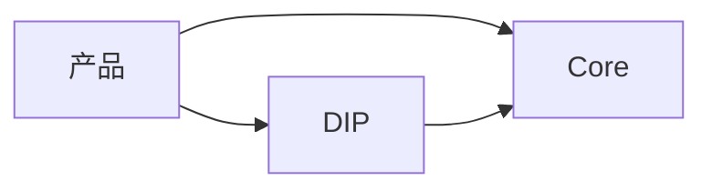

# BKN Foundry 架构设计规范（ARCHITECTURE）

中文 | [English](ARCHITECTURE.md)

本文件为 BKN Foundry 的架构设计规范。**日常研发只需要阅读第 1～2 章**；附录仅用于查术语与复制示例。

## 1. 架构规范

### 1.1 分层与依赖

- **Core（无 UI）**：Core 不包含 UI/Web Console/Portal/BFF；对外仅提供 **API/SDK** 与管理 API。
- **DIP（唯一展示入口）**：所有展示在 DIP；DIP **运行时必须依赖 Core**。
- **产品依赖**：产品均可调用 DIP 或 Core；DIP 只能调用 Core；禁止反向依赖。
- **组件可选性**：除 DIP 基座外，其他能力组件默认可选，必须支持启用/禁用与 UI 降级提示（见第 2 章检查清单）。



### 1.2 展示层与后端（禁止页面专属 BFF）

- **DIP 前端采用 Monorepo（强制）**：DIP 主应用、共享组件库、微前端模块（含 Info Security Fabric 的前端组件）统一在一个 monorepo 内协作。
- **允许**：按业务与交付边界拆分**微应用**（微前端/微应用模块）。
- **禁止**：
  - 每个页面/微前端模块新增专属后端（页面专属 BFF）
  - 为每个微应用新增后端微服务（微应用可以拆，但不带后端服务拆分）
  - 为每个微前端模块单独维护一个前端仓库（除非明确合规/交付边界并通过架构评审）
- **调用路径**：
  - 浏览器可直连 Core Public API（条件允许时）
  - 或通过统一 API Gateway 承载鉴权透传与必要协议适配
  - 或通过 **DIP Gateway（平台共享，可选）**：仅用于通用能力（鉴权透传、协议适配、缓存、限流、聚合等），**禁止**演化为“每模块/每页面一个 BFF”

允许新增的“展示相关后端”仅三类：

- **DIP Gateway（平台共享，可选）**
  - 允许：通用鉴权透传、协议适配、缓存、限流、聚合（面向多模块复用）
  - 禁止：页面专属接口、仅为单一路由做字段拼装/转发
- **DIP 模块后端**（必须具备独立领域数据与业务逻辑）
  - 允许模块：ChatData / AI Store / Data Semantic Governance（新增模块需经评审确认）
  - 不得只做字段映射/拼装/聚合；不得成为页面专属 BFF
  - 对 Core 的调用必须走 **Core Public API**，并满足统一鉴权/租户/审计要求
- **产品域服务**（确有领域模型/事务/规则/数据归属）
  - 若只是展示聚合/查询拼装/字段映射 → 归入前端聚合

新增后端服务前必须回答：

- 是否有持久化领域数据与一致性/事务要求？
- 是否有必须在服务端执行且无法复用平台能力的权限/合规策略？
- 是否有长期演进的领域模型（不是临时拼接）？
- 是否被多个产品复用且不属于 Core 能力？

若都否 → 不新增服务。

### 1.3 API 规则（Core Public API 必须向下兼容）

- **API 分层**：Public / Internal / Experimental
  - 跨组件依赖只允许 Public；Internal/Experimental 不得跨组件引用
- **Core 向下兼容**：
  - Core 的 Public API **必须向下兼容**（同一 major 内禁止破坏性变更）
  - 任何被 DIP/产品调用的 Core 接口，一律按 Public API 管理
- **版本策略（HTTP）**：只使用 URL major（`/api/v1` → `/api/v2`）
  - 同一 major 仅允许：新增字段（可选/默认语义）、新增 endpoint、扩展枚举（客户端容忍未知值）
  - 破坏性变更：只能新增 `/api/v2`，并提供 deprecation window（例如 2 个 release 或 90 天）
- **契约规范**：
  - HTTP：OpenAPI 3.1（统一错误模型 + 分页/过滤/排序）
  - Skill：Claude Skills（tool/function calling），需声明权限/租户/审计与输入/输出 schema

- **兼容性定义（必须满足）**：
  - **输入兼容（Request/Input）**：老客户端/老调用方缺字段、旧字段值仍可处理；不得把可选字段改为必填。
  - **输出兼容（Response/Output）**：允许新增字段；不得删除/重命名既有字段；调用方必须忽略未知字段。
  - **行为兼容（Behavior）**：同名接口语义稳定；不得“同名不同义”。

- **Skill 也必须兼容（Claude Skills）**：
  - 只要某个 Skill 被 DIP/产品使用，就按 **Public** 管理，并遵守向下兼容。
  - **name 稳定**：`name` 一经发布不得修改（改名视为新 Skill）。
  - **schema 兼容**：
    - `input_schema` 只允许新增可选字段/新增枚举值（调用方容忍未知值）；不得删除字段、不得把可选改必填。
    - `output_schema` 只允许新增字段；不得删除/重命名既有字段。
  - **破坏性变更**：只能通过新 `version`（必要时新 `name`）并提供 deprecation window。
- **变更要求**：API 变更必须附带 ADR（架构决策记录）+ OpenAPI diff（breaking 检测）+ contract test（关键 endpoint）

### 1.4 服务数量预算（强制）

- **Core**：后端微服务数量 **< 5**
- **DIP**：后端微服务数量 **≤ 5**

统计口径：

- 计入：可独立部署/伸缩、拥有独立运行时与发布节奏的后端服务（包含 DIP 模块后端、Core 内部服务等）
- 计入：可独立部署/伸缩、拥有独立运行时与发布节奏的后端服务（包含 DIP Gateway〔如启用〕、DIP 模块后端、Core 内部服务等）
- 不计入：数据库/缓存/消息中间件等基础设施；前端 monorepo 内的微前端模块；仅用于本地开发的 mock

执行方式（最小要求）：

- 新增/拆分后端服务时，同步更新“服务清单”（仓库现状为准），并在 PR 描述中给出 Core/DIP 计数结果
- CI 至少包含一个统计检查点（超预算需显式豁免）

豁免条件（必须记录）：

- 仅允许短期豁免，并同步提交收敛计划与时间表

## 2. 强制检查清单（必读）

- **依赖方向**：产品/产业可到 DIP 或 Core；DIP 只能到 Core；禁止反向依赖
- **Core 无 UI**：Core repo 不出现 React/Vue/静态资源/页面路由/Web Console
  - 例外（仅 Info Security Fabric）：Info Security Fabric 的独立前端组件允许存在，但必须由 DIP 统一挂载
- **可选组件**：禁用可选组件后系统仍可启动；DIP UI 有明确降级提示
- **API**：OpenAPI 更新 + breaking 检测通过 + deprecation/迁移说明 + contract test
- **后端新增**：不得为页面专属 BFF；若新增服务必须符合 1.2 的判定问题
- **微应用**：允许拆微应用；禁止为微应用新增后端微服务（后端只能落在 DIP Gateway / DIP 模块后端 / 产品域服务三类）
- **Monorepo**：DIP 前端采用 monorepo（包含微应用/微前端）。拆微应用不得引入新的后端微服务。
- **预算**：Core < 5，DIP ≤ 5；服务清单与计数同步更新

---

## 附录：术语与示例（按需）

### A.1 术语表（扩展）

- **页面专属后端 / 页面专属 BFF**：仅服务某一个页面/路由/微前端模块的后端服务；主要做字段拼装/转发/权限过滤以支撑该页面。
- **DIP 模块后端**：DIP 内能力模块的后端服务（仅限 ChatData / AI Store / Data Semantic Governance 及评审确认模块），必须具备独立领域数据与业务逻辑。
- **微前端模块**：可独立构建/发布，最终由 DIP 统一挂载的前端模块。

### A.2 OpenAPI 示例（最小片段）

```yaml
openapi: 3.1.0
info:
  title: Knowledge Query Public API
  version: 1.2.0
paths:
  /api/v1/knowledge/queries:
    get:
      summary: List queries
      parameters:
        - in: query
          name: page
          schema: { type: integer, minimum: 1, default: 1 }
      responses:
        "200":
          description: OK
        "401":
          description: Unauthorized
        "500":
          description: Internal Server Error
```

### A.3 Skill 示例（Claude Skills / tool calling）

```yaml
---
name: knowledge.query
version: 1.0.0
stability: public
description: "Query the knowledge network and return structured results."
---

# X SKILL
```
