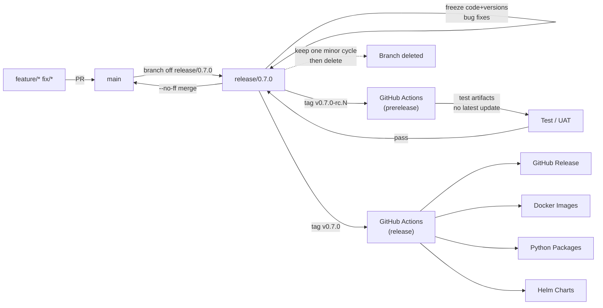

# Release Guidelines

[中文](RELEASE.zh.md) | English

This document defines the version management, branching strategy, and release process for the KWeaver project.

---

## 📋 Table of Contents

- [Branching Strategy](#-branching-strategy)
- [Versioning](#-versioning)
- [Release Process](#-release-process)
- [Changelog Guidelines](#-changelog-guidelines)
- [Patch Releases](#-patch-releases)

---

## 🌿 Branching Strategy

### Trunk-based Development

BKN Foundry follows the **Trunk-based Development** model with these core principles:

| Principle | Description |
| --- | --- |
| **main is always releasable** | The `main` branch is always in a releasable state; a release can be created from `main` at any time |
| **Short-lived branches** | Feature and fix branches should be short-lived, typically no more than 2-3 days |
| **Small PRs** | Each PR should focus on a single responsibility for easier review and rollback |

### Branch Naming Convention

| Branch Type | Format | Description | Example |
| --- | --- | --- | --- |
| Main branch | `main` | Always-releasable trunk | `main` |
| Feature branch | `feature/*` | New feature development | `feature/add-oauth-support` |
| Fix branch | `fix/*` | Bug fixes | `fix/memory-leak-in-loader` |
| Release branch | `release/x.y.z` | Release prep + patch maintenance | `release/1.2.0` |

### Branch Lifecycle

```text
main ─────────────────────────────────────────────────────────►
       │                    │                    │
       │ feature/foo        │ fix/bar            │
       └──────┬─────────────┴──────┬─────────────┘
              │                    │
              ▼ (merge & delete)   ▼ (merge & delete)
```

**Best Practices:**

- ✅ Create branches from `main`
- ✅ Frequently rebase to stay in sync with `main`
- ✅ Delete branches immediately after merging
- ❌ Avoid long-lived feature branches
- ❌ Avoid merging between branches (merging `release/x.y.z` back into `main` is the declared exception)

---

## 🏷️ Versioning

### Semantic Versioning

BKN Foundry follows [Semantic Versioning 2.0.0](https://semver.org/):

```
vMAJOR.MINOR.PATCH[-PRERELEASE]
```

| Version | Meaning | When to Increment |
| --- | --- | --- |
| **MAJOR** | Major version | Incompatible API changes |
| **MINOR** | Minor version | Backward-compatible new features |
| **PATCH** | Patch version | Backward-compatible bug fixes |

### Pre-release Versions

| Tag Format | Description | Example |
| --- | --- | --- |
| `-alpha.N` | Internal testing, incomplete features | `v1.2.0-alpha.1` |
| `-beta.N` | Public testing, complete but may have bugs | `v1.2.0-beta.1` |
| `-rc.N` | Release candidate, ready for release | `v1.2.0-rc.1` |

### Tag Conventions

| Rule | Description |
| --- | --- |
| Prefix | Must start with `v` |
| Format | `vX.Y.Z` or `vX.Y.Z-rc.N` |
| Signing | GPG-signed tags are recommended |

**Correct Examples:**

```bash
# Release version
git tag -a v1.0.0 -m "Release v1.0.0"

# Pre-release version
git tag -a v1.1.0-rc.1 -m "Release candidate 1 for v1.1.0"

# Signed tag
git tag -s v1.0.0 -m "Release v1.0.0"
```

**Incorrect Examples:**

```bash
# ❌ Missing v prefix
git tag 1.0.0

# ❌ Non-standard pre-release format
git tag v1.0.0-RC1
git tag v1.0.0.rc.1
```

---

## 🚀 Release Process

BKN Foundry uses the **Release With Freeze** model: every minor / major release must go through an RC validation cycle, and tag-triggered GitHub Actions perform artifact build & publish.

### End-to-end Overview



Equivalent textual steps:

1. Develop on `feature/*` / `fix/*` branches
2. Merge into `main` via PR
3. Branch off `release/0.7.0` from `main`
4. Run tests, fix bugs, freeze versions on `release/0.7.0`
5. Tag RCs on `release/0.7.0`: `v0.7.0-rc.1` / `v0.7.0-rc.2`
6. RC tags trigger GitHub Actions to build test artifacts (marked as `prerelease`)
7. After RC validation, tag the final release on `release/0.7.0`: `v0.7.0`
8. The release tag triggers GitHub Actions
9. A GitHub Release is auto-generated (non-prerelease)
10. Docker images / Python packages / Helm charts are auto-published, and `latest` is updated
11. `release/0.7.0` is merged back to `main` with `--no-ff`
12. `release/0.7.0` is kept for one minor cycle for patches (see "Patch Releases"); after that, or once no more patches are needed, the branch is deleted (tags are kept forever)

### Automated Releases

Releases are fully **tag-triggered**:

```text
Developer pushes tag  →  GitHub Actions detects tag  →  Run tests  →  Build artifacts  →  Publish Release
```

#### Tag Type → CI Behavior Matrix

| Tag Type | GitHub Release | Image / Package Tag | `latest` / `stable` Alias | Helm Chart |
| --- | --- | --- | --- | --- |
| `vX.Y.Z-rc.N` | `prerelease: true` | `X.Y.Z-rc.N` | Not updated | Not pushed (test artifacts only) |
| `vX.Y.Z` (final) | Regular release | `X.Y.Z` + `latest` | Updated | Pushed to chart repository |

> 📝 The `.github/workflows/` directory does not yet exist in the repo. This section is the agreed-upon contract; the corresponding workflows will land in a separate PR. All workflow trigger conditions and outputs must align with the table above.

### Steps

#### 1. Create Release Branch

```bash
# Create release branch from main
git checkout main
git pull origin main
git checkout -b release/1.2.0

# Push release branch
git push origin release/1.2.0
```

#### 2. Code Freeze

Once the release branch is created, it enters **code freeze** state:

| Allowed ✅ | Forbidden ❌ |
| --- | --- |
| Bug fixes | New features |
| Documentation updates | Refactoring |
| Version number updates | Performance optimizations (unless fixing issues) |
| Configuration adjustments | Dependency upgrades (unless security fixes) |

**Version freeze checklist** — align all of the following to the upcoming `X.Y.Z` on the release branch:

- `version` / `appVersion` of every Helm chart, e.g.:
  - `infra/oss-gateway-backend/charts/Chart.yaml`
  - `infra/mf-model-manager/charts/Chart.yaml`
  - `infra/mf-model-api/charts/Chart.yaml`
  - `deploy/charts/proton-mariadb/Chart.yaml`
- Every Python package's `pyproject.toml`, e.g.:
  - `infra/sandbox/sandbox_control_plane/pyproject.toml`
  - `decision-agent/agent-backend/agent-memory/pyproject.toml`
  - `decision-agent/agent-backend/agent-executor/pyproject.toml`
- Repository-level version entry / `CHANGELOG.md` version section
- Hardcoded versions in image / deployment manifests

#### 3. Publish RC Versions

```bash
# Publish first RC on release branch
git checkout release/1.2.0
git tag -a v1.2.0-rc.1 -m "Release candidate 1 for v1.2.0"
git push origin v1.2.0-rc.1

# After fixing issues, publish subsequent RCs
git tag -a v1.2.0-rc.2 -m "Release candidate 2 for v1.2.0"
git push origin v1.2.0-rc.2
```

> RC tags must be published as `prerelease: true` GitHub Releases that produce only test artifacts. They must **not** update `latest` / `stable` aliases nor push Helm charts to the production chart repository.

#### 4. RC Validation

- Deploy RC version to test / staging environment
- Execute the full test suite
- Perform User Acceptance Testing (UAT)
- Collect feedback, fix issues on the release branch, and publish the next RC

#### 5. Publish Final Release

```bash
# After RC validation passes, publish final release
git checkout release/1.2.0
git tag -a v1.2.0 -m "Release v1.2.0"
git push origin v1.2.0
```

The final tag triggers GitHub Actions to produce:

- ✅ GitHub Release (non-prerelease, with release notes)
- ✅ Docker images (`X.Y.Z` and `latest`), pushed to the Container Registry
- ✅ Python packages (from each `pyproject.toml`)
- ✅ Helm charts (from each `Chart.yaml`), pushed to the chart repository

#### 6. Merge Back to main

BKN Foundry defaults to "fix directly on the release branch, then merge the whole release branch back into main with `--no-ff`":

```bash
git checkout main
git pull origin main
git merge release/1.2.0 --no-ff -m "Merge release/1.2.0 into main"
git push origin main
```

> If `main` is protected as PR-only, open a `chore/merge-release-1.2.0` branch and merge via PR — keeping the spirit of "no cross-branch merging". This step is the declared exception.

#### 7. Release Branch Retention & Deletion

`release/1.2.0` is **kept for one minor cycle** after `v1.2.0` ships (e.g., until `v1.3.0`), and is used to ship `v1.2.1` / `v1.2.2` patches (see "Patch Releases"). When the cycle ends or no further patches are expected:

```bash
# Delete the branch; tags are kept forever
git push origin --delete release/1.2.0
git branch -D release/1.2.0
```

---

### Verify Release

- Check the [GitHub Releases](https://github.com/kweaver-ai/kweaver-core/releases) page
- Verify artifact downloads and integrity
- Confirm Docker images are pullable and Helm charts can be `helm pull`-ed
- Confirm Python packages are installable from the target index

### Release Checklist

Before creating a release tag, confirm:

- [ ] All planned features are merged
- [ ] All tests pass
- [ ] CHANGELOG.md is updated
- [ ] Version number follows semantic versioning
- [ ] All `Chart.yaml` / `pyproject.toml` versions match the tag
- [ ] Documentation is synchronized
- [ ] Breaking changes are documented
- [ ] All RC versions have been validated and their GitHub Releases are marked as prerelease
- [ ] After the final tag, image `latest` / Helm chart repository have been updated
- [ ] Release branch has been merged back to main

---

## 📄 Changelog Guidelines

### Keep a Changelog

BKN Foundry follows the [Keep a Changelog](https://keepachangelog.com/) format.

### File Format

```markdown
# Changelog

All notable changes to this project will be documented in this file.

The format is based on [Keep a Changelog](https://keepachangelog.com/),
and this project adheres to [Semantic Versioning](https://semver.org/).

## [Unreleased]

### Added
- New features

### Changed
- Changes to existing functionality

### Deprecated
- Features to be removed in future versions

### Removed
- Removed features

### Fixed
- Bug fixes

### Security
- Security-related fixes

## [1.1.0] - 2025-01-09

### Added
- Add OAuth 2.0 authentication support (#123)
- Add batch import functionality (#456)

### Fixed
- Fix memory leak issue (#789)

## [1.0.0] - 2024-12-01

### Added
- Initial release
```

### Change Types

| Type | Description |
| --- | --- |
| **Added** | New features |
| **Changed** | Changes to existing functionality |
| **Deprecated** | Features to be removed in next major version |
| **Removed** | Removed features |
| **Fixed** | Bug fixes |
| **Security** | Security vulnerability fixes |

### Writing Guidelines

- ✅ Link each entry to a PR or Issue number
- ✅ Categorize by change type
- ✅ Use user-friendly language
- ✅ Highlight breaking changes in bold
- ❌ Don't include internal refactoring details (unless user-facing)
- ❌ Don't include CI/test-related changes

---

## 🔄 Patch Releases

After `vX.Y.Z` ships, fixes that surface during the retention window of `release/X.Y.Z` are released as patches (`vX.Y.Z+1`) directly from that branch.

### When to Issue a Patch

| Scenario | Patch? |
| --- | --- |
| Security vulnerability fixes | ✅ Required |
| Critical bug fixes | ✅ Recommended |
| General bug fixes | ⚠️ Depends on impact; otherwise defer to the next minor |
| New features | ❌ Never via patch |
| Refactoring | ❌ Never via patch |

### Patch Process

#### 1. Fix on the Release Branch

```bash
git checkout release/1.2.0
git pull origin release/1.2.0

# Commit the fix
git commit -m "fix(auth): patch security vulnerability CVE-2025-XXXX"
git push origin release/1.2.0
```

#### 2. (Optional) Publish RC for Validation

For high-impact patches, an RC cycle is still encouraged:

```bash
git tag -a v1.2.1-rc.1 -m "Release candidate 1 for v1.2.1"
git push origin v1.2.1-rc.1
```

#### 3. Publish the Patch Tag

```bash
git tag -a v1.2.1 -m "Release v1.2.1"
git push origin v1.2.1
```

The final tag triggers GitHub Actions in the same way as a regular release tag.

#### 4. Sync the Fix Back to main

The same fix must reach `main` to avoid regressions on the trunk. Choose either approach:

```bash
# Approach A: cherry-pick standalone
git checkout main
git pull origin main
git cherry-pick -x <commit-hash>
git push origin main
```

```bash
# Approach B: rely on the next overall merge-back
# (must happen at least once before the release branch is deleted)
git merge release/1.2.0 --no-ff -m "Merge release/1.2.0 into main"
```

### Patch Checklist

- [ ] Fix is limited to bug / security fixes — no new features
- [ ] `release/X.Y.Z` is still within its retention window
- [ ] CHANGELOG `[X.Y.Z+1]` section is updated
- [ ] Affected `Chart.yaml` / `pyproject.toml` versions are bumped
- [ ] Patch version is correctly incremented
- [ ] Fix has been synced back to `main` via cherry-pick or a merge-back

---

## 📚 Resources

- [Semantic Versioning](https://semver.org/)
- [Conventional Commits](https://www.conventionalcommits.org/)
- [Keep a Changelog](https://keepachangelog.com/)
- [Trunk Based Development](https://trunkbaseddevelopment.com/)

---

*Last updated: 2026-04-27*
