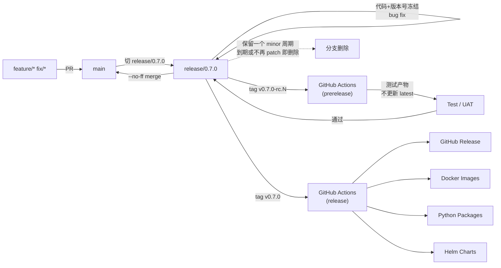

# 版本发布规范

中文 | [English](RELEASE.md)

本文档定义了 BKN Foundry 项目的版本管理、分支策略和发布流程规范。

---

## 📋 目录

- [分支策略](#-分支策略)
- [版本号规范](#-版本号规范)
- [发布流程](#-发布流程)
- [Changelog 规范](#-changelog-规范)
- [Patch 版本发布](#-patch-版本发布)

---

## 🌿 分支策略

### Trunk-based Development

BKN Foundry 采用 **Trunk-based Development** 模型，核心原则：

| 原则 | 说明 |
| --- | --- |
| **main 永远可发布** | `main` 分支始终保持可发布状态，任何时候都可以从 `main` 创建 release |
| **短生命周期分支** | 功能分支和修复分支应尽量短小，通常不超过 2-3 天 |
| **小 PR** | 每个 PR 应聚焦单一职责，便于 review 和回滚 |

### 分支命名规范

| 分支类型 | 命名格式 | 说明 | 示例 |
| --- | --- | --- | --- |
| 主分支 | `main` | 永远可发布的主干 | `main` |
| 功能分支 | `feature/*` | 新功能开发 | `feature/add-oauth-support` |
| 修复分支 | `fix/*` | Bug 修复 | `fix/memory-leak-in-loader` |
| 发布分支 | `release/x.y.z` | 发布准备 + patch 维护 | `release/1.2.0` |

### 分支生命周期

```text
main ─────────────────────────────────────────────────────────►
       │                    │                    │
       │ feature/foo        │ fix/bar            │
       └──────┬─────────────┴──────┬─────────────┘
              │                    │
              ▼ (merge & delete)   ▼ (merge & delete)
```

**最佳实践：**

- ✅ 从 `main` 创建分支
- ✅ 频繁 rebase 保持与 `main` 同步
- ✅ 合并后立即删除分支
- ❌ 避免长期存在的功能分支
- ❌ 避免分支之间相互合并（`release/x.y.z` 合回 `main` 是已声明的例外）

---

## 🏷️ 版本号规范

### 语义化版本 (Semantic Versioning)

BKN Foundry 遵循 [Semantic Versioning 2.0.0](https://semver.org/lang/zh-CN/) 规范：

```
vMAJOR.MINOR.PATCH[-PRERELEASE]
```

| 版本号 | 含义 | 何时递增 |
| --- | --- | --- |
| **MAJOR** | 主版本号 | 不兼容的 API 变更 |
| **MINOR** | 次版本号 | 向后兼容的功能新增 |
| **PATCH** | 修订号 | 向后兼容的 Bug 修复 |

### 预发布版本

| 标签格式 | 说明 | 示例 |
| --- | --- | --- |
| `-alpha.N` | 内部测试版，功能不完整 | `v1.2.0-alpha.1` |
| `-beta.N` | 公开测试版，功能完整但可能有 Bug | `v1.2.0-beta.1` |
| `-rc.N` | 发布候选版，准备正式发布 | `v1.2.0-rc.1` |

### Tag 规范

| 规则 | 说明 |
| --- | --- |
| 前缀 | 必须以 `v` 开头 |
| 格式 | `vX.Y.Z` 或 `vX.Y.Z-prerelease.N` |
| 签名 | 推荐使用 GPG 签名 tag |

**正确示例：**

```bash
# 正式版本
git tag -a v1.0.0 -m "Release v1.0.0"

# 预发布版本
git tag -a v1.1.0-rc.1 -m "Release candidate 1 for v1.1.0"

# 带签名的 tag
git tag -s v1.0.0 -m "Release v1.0.0"
```

**错误示例：**

```bash
# ❌ 缺少 v 前缀
git tag 1.0.0

# ❌ 非标准预发布格式
git tag v1.0.0-RC1
git tag v1.0.0.rc.1
```

---

## 🚀 发布流程

BKN Foundry 采用 **冻结发布（Release With Freeze）** 模式：所有 minor / major 版本都需要经过 RC 验证周期，由 tag 触发 GitHub Actions 完成产物构建与发布。

### 端到端流程概览



对应文字版步骤：

1. 在 `feature/*` / `fix/*` 分支开发
2. 通过 PR 合入 `main`
3. 从 `main` 切出 `release/0.7.0`
4. 在 `release/0.7.0` 上做测试、bug fix、版本号冻结
5. 在 `release/0.7.0` 打 RC tag：`v0.7.0-rc.1` / `v0.7.0-rc.2`
6. RC tag 触发 GitHub Actions 构建测试产物（标记 prerelease）
7. RC 验证通过后，在 `release/0.7.0` 打正式 tag：`v0.7.0`
8. 正式 tag 触发 GitHub Actions
9. 自动生成 GitHub Release（非 prerelease）
10. 自动发布 Docker 镜像 / Python 包 / Helm Chart，并更新 `latest`
11. `release/0.7.0` 通过 `--no-ff` merge 合回 `main`
12. `release/0.7.0` 保留一个 minor 周期用于 patch（详见「Patch 版本发布」），到期或确认无需维护后删除分支；tag 永久保留

### 自动化发布

发布完全由 **tag 触发**：

```text
开发者 push tag  →  GitHub Actions 检测到 tag  →  运行测试  →  构建制品  →  发布 Release
```

#### tag 类型 → CI 行为矩阵

| tag 类型 | GitHub Release | 镜像 / 包 tag | `latest` / `stable` 别名 | Helm Chart |
| --- | --- | --- | --- | --- |
| `vX.Y.Z-rc.N` | `prerelease: true` | `X.Y.Z-rc.N` | 不更新 | 不推送（仅产出测试产物） |
| `vX.Y.Z`（正式） | 正式 release | `X.Y.Z` + `latest` | 更新 | 推送到 chart 仓库 |

> 📝 当前仓库尚未落地 `.github/workflows/`，本节为发布约定，对应工作流将作为单独 PR 提交。所有工作流的触发条件、产物输出必须与上表对齐。

### 步骤

#### 1. 创建 Release 分支

```bash
# 从 main 创建 release 分支
git checkout main
git pull origin main
git checkout -b release/1.2.0

# 推送 release 分支
git push origin release/1.2.0
```

#### 2. 代码冻结 (Code Freeze)

Release 分支创建后进入**代码冻结**状态：

| 允许 ✅ | 禁止 ❌ |
| --- | --- |
| Bug 修复 | 新功能 |
| 文档更新 | 重构 |
| 版本号更新 | 性能优化（除非修复问题） |
| 配置调整 | 依赖升级（除非修复安全问题） |

**版本号冻结清单**：在 release 分支上需要将以下版本号统一对齐到将要发布的 `X.Y.Z`：

- 各 Helm Chart 的 `version` / `appVersion`，例如：
  - `infra/oss-gateway-backend/charts/Chart.yaml`
  - `infra/mf-model-manager/charts/Chart.yaml`
  - `infra/mf-model-api/charts/Chart.yaml`
  - `deploy/charts/proton-mariadb/Chart.yaml`
- 各 Python 包的 `pyproject.toml`，例如：
  - `infra/sandbox/sandbox_control_plane/pyproject.toml`
  - `decision-agent/agent-backend/agent-memory/pyproject.toml`
  - `decision-agent/agent-backend/agent-executor/pyproject.toml`
- 仓库根的版本入口 / `CHANGELOG.md` 版本节
- 镜像 / 部署清单中显式写死的版本号

#### 3. 发布 RC 版本

```bash
# 在 release 分支上发布第一个 RC
git checkout release/1.2.0
git tag -a v1.2.0-rc.1 -m "Release candidate 1 for v1.2.0"
git push origin v1.2.0-rc.1

# 修复问题后，发布后续 RC
git tag -a v1.2.0-rc.2 -m "Release candidate 2 for v1.2.0"
git push origin v1.2.0-rc.2
```

> RC tag 触发的 GitHub Actions 必须以 `prerelease: true` 发布 Release，仅产出测试产物，**不**更新 `latest` / `stable` 别名，**不**推送 Helm Chart 到正式 chart 仓库。

#### 4. RC 验证

- 在测试 / 预发布环境部署 RC 版本
- 执行完整的测试用例
- 进行用户验收测试（UAT）
- 收集反馈并在 release 分支上修复发现的问题，再发下一个 RC

#### 5. 发布正式版本

```bash
# RC 验证通过后，发布正式版本
git checkout release/1.2.0
git tag -a v1.2.0 -m "Release v1.2.0"
git push origin v1.2.0
```

正式 tag 触发的 GitHub Actions 自动产出以下产物：

- ✅ GitHub Release（非 prerelease，附 Release Notes）
- ✅ Docker 镜像（`X.Y.Z` 与 `latest`），推送至 Container Registry
- ✅ Python 包（来自仓库内各 `pyproject.toml`）
- ✅ Helm Chart（来自仓库内各 `Chart.yaml`），推送至 chart 仓库

#### 6. 合回 main

BKN Foundry 默认采用「fix 直接在 release 分支提交，最终整体 `--no-ff` 合回 main」的回流策略：

```bash
# 将 release 分支合并回 main
git checkout main
git pull origin main
git merge release/1.2.0 --no-ff -m "Merge release/1.2.0 into main"
git push origin main
```

> 若团队启用了 main 的 PR-only 保护，则改为开 `chore/merge-release-1.2.0` 分支提 PR 合并，与「分支之间避免相互合并」保持口径一致；本步骤是已声明的例外。

#### 7. Release 分支保留与销毁

`release/1.2.0` 在发完 `v1.2.0` 后**保留一个 minor 周期**（例如直到 `v1.3.0` 发布前），期间专门用于发 `v1.2.1` / `v1.2.2` 等 patch（详见「Patch 版本发布」）。周期结束 / 确认不再发 patch 后：

```bash
# 删除分支；tag 永久保留
git push origin --delete release/1.2.0
git branch -D release/1.2.0
```

---

### 验证发布

- 检查 [GitHub Releases](https://github.com/kweaver-ai/kweaver-core/releases) 页面
- 验证制品下载和完整性
- 确认 Docker 镜像可拉取，Helm Chart 可 `helm pull`
- 确认 Python 包可在目标 index 安装

### 发布检查清单

在创建 release tag 之前，请确认：

- [ ] 所有计划功能已合并
- [ ] 所有测试通过
- [ ] CHANGELOG.md 已更新
- [ ] 版本号符合语义化版本规范
- [ ] 各 `Chart.yaml` / `pyproject.toml` 版本号已与 tag 对齐
- [ ] 文档已同步更新
- [ ] Breaking Changes 已在文档中说明
- [ ] 所有 RC 版本已验证通过，且 GitHub Release 标记为 prerelease
- [ ] 正式 tag 后镜像 `latest` / Helm chart 仓库已更新
- [ ] Release 分支已合并回 main

---

## 📄 Changelog 规范

### Keep a Changelog

BKN Foundry 遵循 [Keep a Changelog](https://keepachangelog.com/zh-CN/) 规范。

### 文件格式

```markdown
# Changelog

本项目所有重要变更都将记录在此文件中。

格式基于 [Keep a Changelog](https://keepachangelog.com/zh-CN/)，
本项目遵循 [语义化版本](https://semver.org/lang/zh-CN/)。

## [Unreleased]

### Added
- 新增的功能

### Changed
- 变更的功能

### Deprecated
- 即将废弃的功能

### Removed
- 已移除的功能

### Fixed
- 修复的 Bug

### Security
- 安全相关的修复

## [1.1.0] - 2025-01-09

### Added
- 新增 OAuth 2.0 认证支持 (#123)
- 新增批量导入功能 (#456)

### Fixed
- 修复内存泄漏问题 (#789)

## [1.0.0] - 2024-12-01

### Added
- 首次发布
```

### 变更类型

| 类型 | 说明 |
| --- | --- |
| **Added** | 新增功能 |
| **Changed** | 功能变更 |
| **Deprecated** | 即将废弃（下个主版本移除） |
| **Removed** | 已移除功能 |
| **Fixed** | Bug 修复 |
| **Security** | 安全漏洞修复 |

### 编写规范

- ✅ 每条记录关联 PR 或 Issue 编号
- ✅ 按变更类型分类
- ✅ 使用用户可理解的语言描述
- ✅ Breaking Changes 放在显著位置并加粗
- ❌ 不要包含内部重构细节（除非影响用户）
- ❌ 不要包含 CI / 测试相关变更

---

## 🔄 Patch 版本发布

正式版本 `vX.Y.Z` 发布后，若在保留期内的 `release/X.Y.Z` 上发现需要修复的问题，可在该分支上发 patch（`vX.Y.Z+1`）。

### 何时发 patch

| 场景 | 是否发 patch |
| --- | --- |
| 安全漏洞修复 | ✅ 必须 |
| 严重 Bug 修复 | ✅ 推荐 |
| 一般 Bug 修复 | ⚠️ 视影响面决定，必要时合并到下一个 minor |
| 新功能 | ❌ 不通过 patch 发布 |
| 重构 | ❌ 不通过 patch 发布 |

### Patch 流程

#### 1. 在 release 分支上修复

```bash
git checkout release/1.2.0
git pull origin release/1.2.0

# 提交修复
git commit -m "fix(auth): patch security vulnerability CVE-2025-XXXX"
git push origin release/1.2.0
```

#### 2.（可选）发 RC 验证

对于影响面较大的 patch，仍可以走 RC 流程：

```bash
git tag -a v1.2.1-rc.1 -m "Release candidate 1 for v1.2.1"
git push origin v1.2.1-rc.1
```

#### 3. 发布 patch tag

```bash
git tag -a v1.2.1 -m "Release v1.2.1"
git push origin v1.2.1
```

正式 tag 同样触发 GitHub Actions 完成产物构建与发布，行为与「正式 tag」一致。

#### 4. 同步修复到 main

修复同样需要回到 `main`，以避免主干回归。两种方式任选其一：

```bash
# 方式 A：单独 cherry-pick
git checkout main
git pull origin main
git cherry-pick -x <commit-hash>
git push origin main
```

```bash
# 方式 B：随下次整体合回（在 release 分支销毁前必须完成一次）
git merge release/1.2.0 --no-ff -m "Merge release/1.2.0 into main"
```

### Patch 检查清单

- [ ] 修复仅限 bug fix / 安全修复，无新功能
- [ ] `release/X.Y.Z` 仍在保留期内
- [ ] CHANGELOG 的 `[X.Y.Z+1]` 节已补
- [ ] 涉及版本号的 `Chart.yaml` / `pyproject.toml` 已更新
- [ ] Patch 版本号正确递增
- [ ] 修复已通过 cherry-pick 或合回 main 同步至主干

---

## 📚 相关资源

- [Semantic Versioning](https://semver.org/lang/zh-CN/)
- [Conventional Commits](https://www.conventionalcommits.org/zh-hans/)
- [Keep a Changelog](https://keepachangelog.com/zh-CN/)
- [Trunk Based Development](https://trunkbaseddevelopment.com/)

---

*最后更新：2026-04-27*
